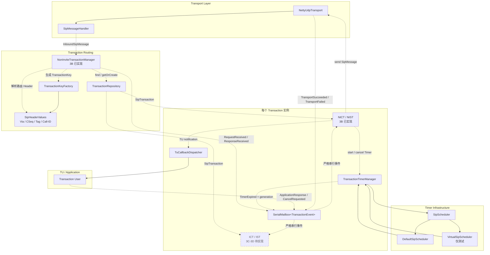

# 里程碑 03：SIP Transaction Layer

## 1. 目标

第三阶段在现有 SIP message/codec 和 Netty UDP Transport 之上实现 Transaction Layer，使请求具备匹配、去重、重传、超时、传输失败处理和明确的状态转换。

```text
Netty UDP Transport
        ↓
Transaction Dispatcher
        ↓
Transaction Repository
        ↓
Transaction Mailbox
        ↓
ICT / IST / NICT / NIST
        ↓
TU Event Dispatcher
        ↓
Application / Transaction User
```

本阶段主要遵循 RFC 3261，并采用 RFC 6026 对 INVITE Transaction 的修正。

## 2. 阶段边界

### 本阶段实现

- Transaction 路由所需的强类型 Header 解析。
- RFC 3261 Transaction ID 和匹配规则。
- Transaction Repository。
- 每个 Transaction 的串行 Mailbox。
- SIP Timer 配置、生产调度器和测试虚拟时钟。
- Transaction Event 模型。
- Non-INVITE Client Transaction（NICT）。
- Non-INVITE Server Transaction（NIST）。
- INVITE Client Transaction（ICT）。
- INVITE Server Transaction（IST）。
- RFC 6026 Accepted 状态和 Timer M/L。
- UDP 请求/响应重传和总超时。
- Transport 成功、失败事件。
- ACK 的 2xx/非 2xx 分流。
- CANCEL 自身事务及其与原 INVITE 的关联。
- Transaction 终止和 Repository 清理。
- TU 回调与状态机执行隔离。

### 本阶段不实现

- Dialog 状态和 Route Set。
- 2xx ACK 的 Dialog 路由逻辑。
- 完整 UAS 2xx 重传管理。
- TCP、TLS 和 WebSocket Transport。
- DNS NAPTR/SRV 和 RFC 3263 目标选择。
- Registrar、Proxy 或 B2BUA 业务实现。
- JAIN-SIP API Adapter。

JAIN-SIP 兼容问题在核心协议栈各阶段介绍和实现完成后单独讨论，后续通过独立 Adapter module 处理，不让 `javax.sip` 类型进入核心。

## 3. 实施拆分

第三阶段范围较大，拆为四个可独立验收的增量：

```text
3A 事务基础设施
    ↓
3B Non-INVITE Transaction
    ↓
3C INVITE Transaction
    ↓
3D RFC 6026、ACK/CANCEL 和完整收尾
```

### 3A：事务基础设施

- Via、CSeq、From、To、Call-ID 强类型读取。
- Transaction ID 和匹配策略。
- Repository。
- Mailbox。
- Scheduler、Timer token 和虚拟时钟。
- Transaction Event 和 TU Event 基础模型。

### 3B：Non-INVITE

- NICT 和 NIST。
- Timer E、F、J、K。
- UDP OPTIONS 事务闭环。
- 丢包、重复请求、重复响应和超时测试。

实施状态：已完成。

- `NonInviteTransactionManager` 分离维护 Client/Server Repository，并在首次发送前注册 NICT。
- NICT 已实现 Trying、Proceeding、Completed、Terminated 以及 Timer E、F、K。
- NIST 已实现首次请求单次 TU 转交、重复请求响应重发以及 Timer J。
- 网络、Timer、TU 命令和异步传输结果统一回到每个 Transaction 的 `SerialMailbox`。
- TU 通知通过独立的 `TuCallbackDispatcher` 顺序执行，不占用 Transaction drain task。
- 已覆盖正常 OPTIONS、受控请求/响应丢包、Timer F、1xx 后最终响应、重复请求去重、传输失败、关闭清理和真实 Netty UDP 回环测试。
- INVITE、ACK、CANCEL 仍明确拒绝，由 3C/3D 实现。

### 3C：INVITE

- ICT 和 IST 基础状态机。
- Timer A、B、D、G、H、I。
- 1xx 和非 2xx 最终响应。
- 非 2xx ACK 自动生成、接收和重发。

### 3D：现代修正与特殊关系

- RFC 6026 Accepted 状态。
- Timer M 和 Timer L。
- 多个或重复 2xx 的 TU 转交。
- CANCEL 自身事务。
- CANCEL 与原 INVITE 的关联。
- 容量限制、异常清理和端到端验证。

## 4. 强类型路由 Header

通用 `SipHeader` 继续负责无损保存报文，但 Transaction 路由不能依赖临时字符串切割。3A 需要增加最小强类型值对象。

### 4.1 Via

```java
public record ViaHeaderValue(
        TransportProtocol transport,
        SentBy sentBy,
        String branch,
        Optional<String> received,
        OptionalInt rport
) {
}
```

至少支持：

- `SIP/2.0/UDP`、TCP 和 TLS token。
- sent-by hostname、IPv4、方括号 IPv6 和可选端口。
- branch。
- received。
- 无值或有值的 rport。
- 未识别参数的保留。

Transaction 匹配只使用 top Via，但 Encoder 仍必须保留全部 Via 和原始顺序。

### 4.2 CSeq

```java
public record CSeqHeaderValue(
        long sequenceNumber,
        SipMethod method
) {
}
```

需要验证数值范围、Method token 和 Header 中多余数据。

### 4.3 From、To 和 Call-ID

本阶段至少提供：

- From tag。
- To tag。
- Call-ID 完整值。
- name-addr/addr-spec 后 Header 参数的可靠读取。

完整 Address/URI 类型化可以继续演进，但 Transaction 匹配需要的字段不能通过 `contains("tag=")` 等方式判断。

### 4.4 访问方式

建议保留通用集合，同时提供类型化读取器：

```java
ViaHeaderValue via = SipHeaderValues.topVia(headers);
CSeqHeaderValue cseq = SipHeaderValues.cseq(headers);
Optional<String> fromTag = SipHeaderValues.fromTag(headers);
```

类型化解析失败应产生可定位的 Header 解析异常，由 Dispatcher 决定丢弃、报告或生成错误响应。

## 5. Transaction ID

### 5.1 RFC 3261 快速匹配

对于带 RFC 3261 magic cookie 的 branch，Transaction ID 主要由以下字段构成：

```text
top Via branch
top Via sent-by
request method / CSeq method
```

```java
public record TransactionId(
        String branch,
        SentBy sentBy,
        SipMethod method
) {
}
```

匹配规则需要明确：

- branch 按协议规则比较，不能随意改写。
- sent-by hostname 比较不区分大小写。
- 缺省端口按 Transport 规范化。
- Method 保持 SIP token 语义。
- ACK 和 CANCEL 使用特殊 Method 映射。

### 5.2 ACK 匹配

- 非 2xx ACK 使用 INVITE method key 查找原 IST。
- 2xx ACK 不属于原 INVITE Transaction，交给 TU/Dialog 路径。

### 5.3 CANCEL 匹配

- CANCEL 自身以 CANCEL method 创建独立 NICT/NIST。
- 查找被取消 INVITE 时，使用相同 branch、sent-by 和 INVITE method 派生关联 ID。

### 5.4 旧式 branch

对不带 magic cookie 的旧式报文，匹配需要使用 Request-URI、From tag、To tag、Call-ID、CSeq 和 top Via 等复合字段。

建议通过独立策略表示：

```java
sealed interface TransactionKey
        permits Rfc3261TransactionKey, LegacyTransactionKey {
}
```

这样兼容逻辑不会散落在 Dispatcher 和四类状态机中。

## 6. Transaction Repository

```java
public interface TransactionRepository {

    Optional<SipTransaction> find(TransactionKey key);

    void register(SipTransaction transaction);

    void remove(TransactionKey key, SipTransaction expected);
}
```

实现要求：

- 使用并发 Map 保存活跃事务。
- Client Transaction 必须先注册，再发送第一条请求。
- 服务端首次请求原子创建 Transaction。
- 重复请求路由至已有 Transaction。
- 终止时使用 `remove(key, expected)`，防止旧清理事件误删新实例。
- 限制最大活跃 Client/Server Transaction 数量。
- 暴露只读数量指标，便于测试和监控泄漏。

Repository 只负责身份和生命周期索引，不执行状态机逻辑。

## 7. Transaction Event

状态机只通过事件改变状态：

```java
public sealed interface TransactionEvent {
}

record RequestReceived(...) implements TransactionEvent {}
record ResponseReceived(...) implements TransactionEvent {}
record ApplicationRequest(...) implements TransactionEvent {}
record ApplicationResponse(...) implements TransactionEvent {}
record TransportSucceeded(...) implements TransactionEvent {}
record TransportFailed(...) implements TransactionEvent {}
record TimerExpired(...) implements TransactionEvent {}
record CancelRequested(...) implements TransactionEvent {}
```

事件应尽量不可变，并携带处理所需的完整上下文。不能让状态机在处理过程中重新访问可变网络对象。

Transport 的 `CompletionStage<SendResult>` 完成后，转换为 `TransportSucceeded` 或 `TransportFailed` 并投递回 mailbox，不能从 Netty 回调直接修改 Transaction。

## 8. Transaction Mailbox

每个 Transaction 拥有独立 FIFO mailbox：

```text
Inbound message
Timer callback
TU command
Transport completion
        ↓
Concurrent event queue
        ↓
Single drain task
        ↓
Transaction state machine
```

### 8.1 并发保证

- 多个线程可以并发投递事件。
- 同一时刻只有一个 drain task。
- 同一 Transaction 严格按入队顺序处理。
- 不同 Transaction 可以在不同虚拟线程并行运行。
- 队列为空时虚拟线程结束。
- 新事件到达时重新调度 drain task。

### 8.2 生命周期

Mailbox 需要支持：

- `OPEN`、`CLOSING`、`CLOSED` 状态。
- Transaction 终止后拒绝新普通事件。
- 已经入队的终止/清理事件能够完成。
- 队列上限和溢出策略。
- 单个事件异常不能让 drain 标志永久卡住。

### 8.3 Executor

使用 Stack 级共享虚拟线程 Executor：

```java
ExecutorService transactionExecutor =
        Executors.newThreadPerTaskExecutor(
                Thread.ofVirtual().name("loomsip-tx-", 0).factory()
        );
```

Mailbox 不创建自己的 Executor，也不永久占用一个虚拟线程。

## 9. TU 回调隔离

Transaction mailbox 不能直接执行可能阻塞的应用代码。

错误方式：

```text
Transaction Mailbox
    ↓
application.onRequest() 阻塞数据库
    ↓
Timer 和重传事件无法处理
```

即使执行线程是虚拟线程，状态机仍被这个调用占用。

正确方式：

```text
Transaction Mailbox
    ↓ 完成状态转换并生成通知
TU Callback Queue
    ↓ 独立虚拟线程顺序消费
Application callback
    ↓ sendResponse()/cancel()
Transaction Mailbox
```

TU Callback Queue 需要保证同一 Transaction 的通知顺序，例如：

```text
100 Trying → 180 Ringing → 200 OK
```

不同 Transaction 的 TU 回调允许并发。应用产生的命令重新投递给 Transaction mailbox，不能直接调用状态机内部方法。

## 10. Scheduler 和 Timer

### 10.1 基础配置

```java
public record SipTimerConfig(
        Duration t1,
        Duration t2,
        Duration t4
) {
}
```

默认值：

```text
T1 = 500 ms
T2 = 4 s
T4 = 5 s
```

### 10.2 调度接口

```java
public interface SipScheduler {

    Cancellable schedule(Duration delay, Runnable callback);
}
```

生产调度器使用少量平台线程。调度线程只投递 `TimerExpired`，不运行状态机和应用代码。

### 10.3 Timer token

取消 Timer 不能保证已经排队的回调消失。每次启动 Timer 都生成 generation/token：

```java
record TimerExpired(
        SipTimer timer,
        long generation
) implements TransactionEvent {
}
```

状态机仅接受当前 generation，忽略已经取消或被替换的旧 Timer 事件。

### 10.4 测试虚拟时钟

测试 Scheduler 支持：

```java
virtualScheduler.advanceBy(Duration.ofSeconds(32));
```

所有状态机 Timer 测试必须使用虚拟时间，不使用 `Thread.sleep()`。

## 11. Timer 对照

| Transaction | Timer | 用途 |
|---|---|---|
| NICT | E | UDP Non-INVITE 请求重传 |
| NICT | F | Non-INVITE Client 总超时 |
| NICT | K | 最终响应后的 UDP 吸收期 |
| NIST | J | 最终响应后的 UDP 吸收期 |
| ICT | A | UDP INVITE 请求重传 |
| ICT | B | INVITE Client 总超时 |
| ICT | D | 非 2xx 最终响应后的吸收期 |
| ICT | M | RFC 6026 Accepted 状态生命周期 |
| IST | G | UDP 非 2xx 最终响应重传 |
| IST | H | 等待非 2xx ACK 的总超时 |
| IST | I | Confirmed 状态吸收期 |
| IST | L | RFC 6026 Accepted 状态生命周期 |

可靠 Transport 和不可靠 Transport 使用同一状态机，但重传 Timer 行为不同。虽然本阶段只实现 UDP，状态机 API 必须接收 Transport reliability，不能把 UDP 判断散落为具体类类型检查。

## 12. NICT

状态：

```text
Trying → Proceeding → Completed → Terminated
```

行为：

- 初始请求发送后启动 Timer E 和 F。
- Timer E 在 UDP 上重传请求，间隔逐步增长并限制到 T2。
- 收到 1xx 进入 Proceeding。
- 收到最终响应进入 Completed，并通知 TU。
- Completed 在 UDP 上启动 Timer K。
- Timer F 到期产生 Transaction timeout。
- Transport 失败终止 Transaction 并通知 TU。

## 13. NIST

状态：

```text
Trying → Proceeding → Completed → Terminated
```

行为：

- 首次请求创建 Transaction 并通知 TU。
- 重复请求不重复通知 TU。
- 已经有响应时，重复请求重发最近响应。
- 发送 1xx 进入或保持 Proceeding。
- 发送最终响应进入 Completed。
- UDP 上启动 Timer J，可靠 Transport 可以立即终止。
- Transport 失败通知 TU 并清理。

## 14. ICT

状态采用 RFC 6026 修正：

```text
Calling ─1xx→ Proceeding
Calling/Proceeding ─2xx→ Accepted ─Timer M→ Terminated
Calling/Proceeding ─300-699→ Completed ─Timer D→ Terminated
```

行为：

- UDP 初始 INVITE 启动 Timer A 和 B。
- Timer A 重传 INVITE。
- 1xx 停止 Timer A 并进入 Proceeding。
- 2xx 进入 Accepted，每个匹配的 2xx 都转交 TU。
- Timer M 控制 Accepted 生命周期。
- 300-699 自动生成非 2xx ACK。
- 重复非 2xx 最终响应触发 ACK 重发。
- Timer D 控制 Completed 吸收期。
- Timer B 到期产生 INVITE timeout。

ICT 不生成 2xx ACK。2xx ACK 由 TU/Dialog 层负责。

## 15. IST

状态采用 RFC 6026 修正：

```text
Proceeding ─2xx→ Accepted ─Timer L→ Terminated
Proceeding ─300-699→ Completed
Completed ─ACK→ Confirmed ─Timer I→ Terminated
Completed ─Timer H→ Terminated
```

行为：

- 首次 INVITE 通知 TU。
- 重复 INVITE 不重复通知 TU。
- TU 未及时生成临时响应时，可以约 200 ms 后自动发送 `100 Trying`。
- 1xx 保持 Proceeding。
- 2xx 进入 Accepted 并启动 Timer L。
- 非 2xx 最终响应进入 Completed。
- UDP 使用 Timer G 重传非 2xx 最终响应。
- Timer H 限制等待 ACK 的总时间。
- 非 2xx ACK 进入 Confirmed 并启动 Timer I。
- 重复 INVITE 触发最近响应重发。

2xx 响应重传和 2xx ACK 处理位于 TU/Dialog 边界，不与非 2xx ACK 状态混合。

## 16. Transaction Dispatcher

Dispatcher 实现 `SipMessageHandler`，负责将 Transport 入站消息转换为 Transaction 事件。

### 请求路径

```text
SipRequest
    ↓ 解析 top Via、CSeq 等路由字段
    ↓ 生成 TransactionKey
    ↓ Repository find/create
    ↓ mailbox.submit(RequestReceived)
```

特殊分支：

- 匹配 IST 的非 2xx ACK 进入已有 Transaction。
- 不匹配 IST 的 ACK 作为 2xx ACK 交给 TU/Dialog 路径。
- CANCEL 先创建自己的 Server Transaction，再查找原 INVITE。
- 缺少必要 Header 时进入 malformed/validation policy。

### 响应路径

```text
SipResponse
    ↓ 解析 top Via branch 和 CSeq method
    ↓ 查找 Client Transaction
    ↓ mailbox.submit(ResponseReceived)
```

未匹配响应不能静默消失，需要形成诊断事件；RFC 6026 Accepted 状态应保证匹配的重复或 forked 2xx 在规定时间内继续转交 TU。

## 17. TU API 初步边界

```java
public interface TransactionUser {

    void onRequest(ServerTransactionHandle transaction, SipRequest request);

    void onResponse(ClientTransactionHandle transaction, SipResponse response);

    void onTimeout(TransactionHandle transaction, TimeoutReason reason);

    void onTransportFailure(TransactionHandle transaction, Throwable cause);
}
```

Handle 只暴露稳定 ID、状态快照和允许的命令：

```java
serverTransaction.sendResponse(response);
clientTransaction.cancel();
```

Handle 方法只向 mailbox 投递事件，不直接改变状态。

## 18. ACK 与 CANCEL

### 18.1 非 2xx ACK

- 由 ICT 自动生成。
- 由 IST 接收并消费。
- 使用 INVITE Transaction key 匹配。
- 重复非 2xx 最终响应触发 ACK 重发。
- 不作为普通 TU 请求重复上报。

### 18.2 2xx ACK

- 是独立请求。
- 不属于原 INVITE Transaction。
- 交给 TU/Dialog 路径。
- 本阶段只完成正确分流，不实现完整 Dialog 路由。

### 18.3 CANCEL

- CANCEL 自身拥有独立 Client/Server Transaction。
- 使用 INVITE 派生 key 查找被取消事务。
- 是否生成 `487 Request Terminated` 取决于原 INVITE 是否已有最终响应。
- 跨事务协调放入独立 `CancelCoordinator`，不塞入 NICT/NIST 或 ICT/IST 单个状态机。

## 19. 失败和资源限制

需要处理：

- Transport 写失败。
- Timer 调度失败。
- Mailbox 队列溢出。
- Repository 容量达到上限。
- TU callback 抛出异常。
- Stack 关闭时仍有活跃 Transaction。
- Transaction 已终止后到达的延迟网络/Timer 事件。

Stack 关闭顺序建议：

```text
停止接收新 Transaction
    ↓
关闭 Transport 入站
    ↓
终止/清理活跃 Transaction
    ↓
关闭 TU Callback Executor
    ↓
关闭 Transaction Executor
    ↓
关闭 Scheduler
```

所有等待中的 TU Handle 操作和异步结果必须得到明确失败，不能悬挂。

## 20. 测试策略

### 20.1 Mailbox

- 多线程并发投递后无事件丢失。
- 单个 Transaction 不并发执行事件。
- drain 结束与新事件到达的竞态。
- 事件异常后仍可继续或按策略关闭。
- 队列上限和关闭拒绝行为。

### 20.2 Repository

- 原子注册。
- 重复 key 拒绝。
- `remove(key, expected)` 不误删其他对象。
- 并发 find/create。
- 容量限制和终止清理。

### 20.3 Scheduler

- Timer generation。
- 取消后旧事件被忽略。
- 同一到期时间的确定顺序。
- `advanceBy` 不依赖真实等待。

### 20.4 状态机

每种状态和事件组合均应覆盖：

- 正常响应。
- 临时响应。
- 重复请求/响应。
- Timer 到期。
- Transport 失败。
- 可靠/不可靠 Transport 差异。
- 终止后的延迟事件。

### 20.5 协议场景

- OPTIONS 第一个请求丢失后 Timer E 重传成功。
- OPTIONS 最终响应丢失后重复请求触发响应重发。
- NICT Timer F 超时。
- INVITE 收到 100、180、非 2xx 最终响应并自动 ACK。
- 非 2xx 最终响应丢失后 Timer G 重传。
- ACK 丢失后最终响应继续重传。
- 2xx ACK 正确绕过原 IST。
- CANCEL 关联原 INVITE。
- TU 回调阻塞时 Transaction Timer 仍能执行。

丢包测试使用可控制的 In-Memory/Test Transport，不依赖真实 UDP 网络随机丢包。真实 UDP 回环继续用于验证 Dispatcher 和 Transport 集成。

## 21. 验收标准

- 同一 Transaction 的事件严格串行。
- 不同 Transaction 能够并发执行。
- TU 阻塞不阻止 Transaction Timer 和网络事件。
- Client Transaction 在首包发送前完成注册。
- 重复服务端请求不重复通知 TU。
- UDP 请求和非 2xx 响应按 Timer 重传。
- 所有总超时产生明确 TU 事件。
- Transport 失败进入明确终止路径。
- Transaction 终止后从 Repository 清理。
- 所有 Timer 测试使用虚拟时间，无 `Thread.sleep()`。
- OPTIONS 完成 NICT/NIST 事务闭环。
- INVITE 完成 ICT/IST 非 2xx ACK 闭环。
- RFC 6026 Accepted 状态和 Timer M/L 生效。
- CANCEL 能创建独立事务并关联原 INVITE。
- Stack 关闭后没有遗留 Transaction、Timer 或线程。
- 所有新增公共 API 包含 Javadoc，`mvn javadoc:javadoc` 无警告。

## 22. 后续衔接

第三阶段完成后，再规划 Dialog Layer，包括 Dialog ID、Route Set、Remote Target、Local/Remote CSeq、2xx ACK、BYE 和 early/confirmed dialog。

JAIN-SIP Adapter 在核心协议能力和公共 API 稳定后统一讨论，不在第三阶段提前引入。

## 23. 组件逻辑关系

下面的组件图展示 Transport、Transaction 路由、单个 Transaction、Timer 和 TU 之间的关系。NICT、NIST 和 Dispatcher 已在 3B 实现，虚线的 ICT/IST 属于后续 3C-3D。



### 23.1 入站报文

```text
NettyUdpTransport
    → SipMessageHandler
    → Transaction Dispatcher
    → SipHeaderValues
    → TransactionKeyFactory
    → TransactionRepository
    → Transaction Mailbox
    → 状态机
```

Dispatcher 使用 Via、CSeq 等字段生成 Transaction Key：

```text
首次请求     → Repository 创建 Transaction
重复请求     → 找到已有 Transaction
响应         → 找到 Client Transaction
非 2xx ACK  → 使用 INVITE Key 查找 IST
2xx ACK     → 查找失败后转交 TU/Dialog 路径
```

### 23.2 Timer

```text
状态机
    → TransactionTimerManager.start()
    → SipScheduler
    → Timer 到期
    → TimerExpired(timer, generation)
    → Transaction Mailbox
    → 状态机检查 generation
```

Scheduler 不直接调用状态机。Timer 事件始终回到 Mailbox，因此不会和网络事件并发修改状态。

### 23.3 TU 回调

```text
状态机完成状态转换
    → TuCallbackDispatcher
    → 独立虚拟线程
    → TU/Application
```

应用产生的命令重新进入 Transaction Mailbox：

```text
TU.sendResponse()
    → ApplicationResponse
    → Transaction Mailbox
    → 状态机
```

业务回调即使阻塞，也不会阻止 Transaction Timer 和网络事件继续处理。

### 23.4 出站发送

```text
状态机
    → NettyUdpTransport.send()
    → Netty ChannelFuture
    → TransportSucceeded / TransportFailed
    → Transaction Mailbox
    → 状态机
```

Transport 的异步完成回调只能产生 Transaction Event，不能直接修改状态机。

当前 3A 已提供 Header、Key、Repository、Mailbox、Timer 和 TU Callback 基础设施；3B 已完成 Non-INVITE Dispatcher、NICT、NIST，以及具有 UDP 重传和超时能力的 OPTIONS 事务闭环。下一步 3C 在同一套事件、Mailbox 和 Timer 基础设施上实现 INVITE Client/Server Transaction。
