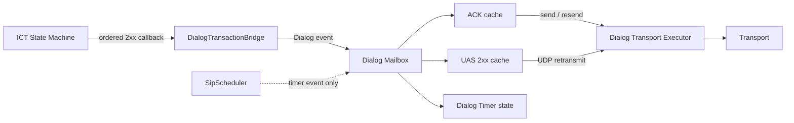
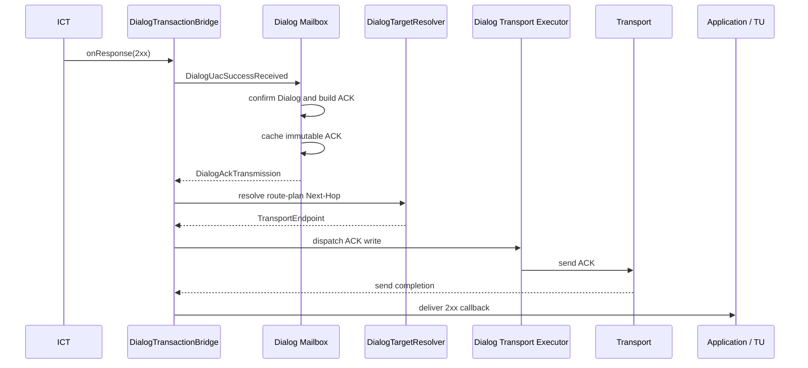
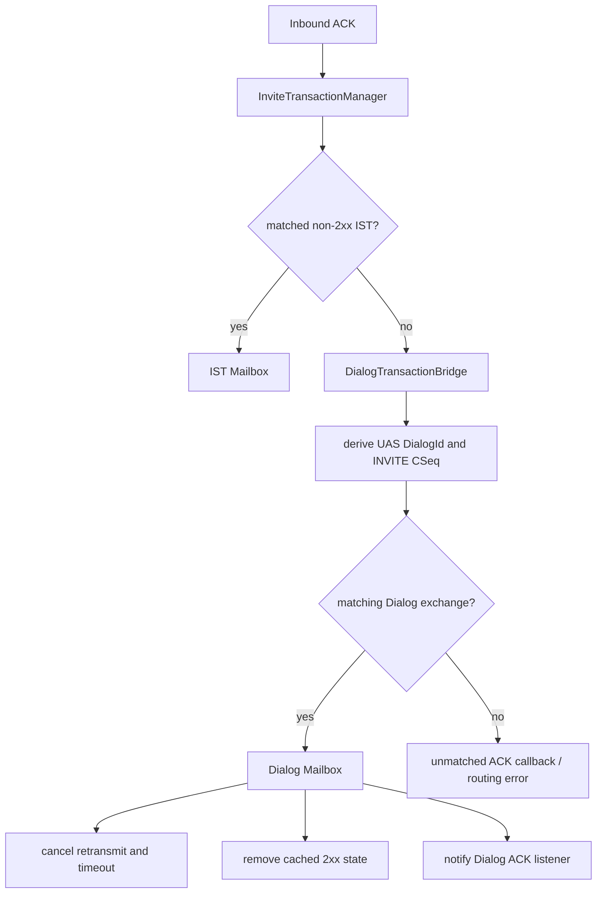
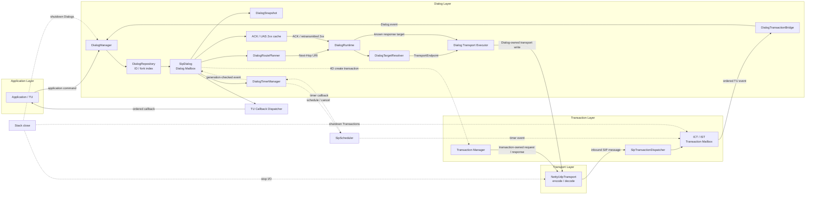

# 第四阶段：Dialog Layer 与基本呼叫

## 1. 背景

前三个里程碑已经提供：

- 不可变 SIP Message、Parser 和 Encoder。
- Netty UDP Transport。
- Transaction Key、Repository、Mailbox 和 Timer 基础设施。
- NICT、NIST、ICT 和 IST。
- RFC 6026 Accepted 状态。
- 非 2xx ACK、2xx ACK 分流和 CANCEL 协调。
- `SipTransactionDispatcher` 统一事务入口。

Transaction 解决一次请求和响应交换的匹配、重传与超时，但不能保存跨 Transaction 的会话状态。第四阶段在 Transaction Layer 之上实现 Dialog Layer，使一个呼叫中的 INVITE、ACK、re-INVITE 和 BYE 能共享稳定的路由、目标和序列状态。

本文件中的“第四阶段”指第四个实现里程碑。总体架构文档旧路线图中的“阶段三：Dialog 与基本呼叫”应在后续统一编号。

## 2. 阶段目标

本阶段实现：

- UAC 和 UAS Dialog ID。
- Early、Confirmed、Terminated 生命周期。
- Dialog Repository 和每个 Dialog 的串行 Mailbox。
- Local/Remote URI、Tag 和 CSeq。
- Route Set 和 Remote Target。
- INVITE 临时响应、2xx 与 Dialog 的建立关系。
- Forked 1xx/2xx 形成多个 Dialog。
- 2xx ACK 生成、缓存、重发和入站路由。
- UDP UAS 2xx 重传和 ACK 等待超时。
- Dialog 内 re-INVITE 和 BYE。
- loose routing 和 strict routing 请求构造。
- target-refresh 更新 Remote Target。
- Transaction 与 Dialog 之间的事件桥接。
- 容量、失败、关闭和真实 UDP 基本呼叫验证。

本阶段不实现：

- SDP Offer/Answer 和媒体协商。
- PRACK、100rel、UPDATE 和 Session Timer。
- Proxy、Registrar 或 B2BUA 业务逻辑。
- TCP、TLS、WebSocket 和 Digest Authentication。
- RFC 3263 DNS NAPTR/SRV 目标选择。
- 完整 JAIN-SIP Adapter。

Body 在本阶段继续作为不透明二进制数据传递。

## 3. 实施拆分

```text
4A Dialog 基础设施
    ↓
4B INVITE 与 Dialog 建立
    ↓
4C 2xx、ACK 与 UAS 可靠性
    ↓
4D Dialog 内请求与基本呼叫
```

### 4A：Dialog 基础设施

实施状态：已完成（2026-07-17）。

- Dialog ID、Role、State 和 Snapshot。
- Contact、Route 和 Record-Route 强类型读取。
- Dialog Repository、容量和二级索引。
- Dialog Event、Mailbox 和 TU Callback 隔离。
- Route Planner 和可注入目标解析边界。

已实现组件：

- `DialogId` 按 UAC/UAS 角色正确解释 From/To tag，并通过 `DialogSetId` 表示 fork 关联。
- `DialogSnapshot` 对外提供不可变状态、Route Set、Remote Target 和合法 SIP CSeq 范围。
- `DialogHeaderValues` 强类型解析 Contact、Route、Record-Route，支持重复行、逗号列表、quoted-string、name-addr、URI 参数和外部参数。
- `InMemoryDialogRepository` 原子维护 `DialogId -> SipDialog` 主索引和 `DialogSetId -> DialogId` 二级索引，并执行容量与 expected-instance removal 约束。
- `SipDialog` 使用按需单消费者 Mailbox 串行处理状态、Local/Remote CSeq 和 Remote Target；TU 回调经独立顺序队列隔离。
- `DialogManager` 负责创建、查找、fork 查询、关闭和执行器所有权；关闭会等待 Dialog Mailbox 与已接受的 TU 回调全部排空。
- `DialogRoutePlanner` 实现空 Route Set、loose routing、strict routing，以及 UAC 逆序/UAS 保序的 Route Set 建立规则。
- `DialogTargetResolver` 保留 SIP Next-Hop 到 `TransportEndpoint` 的异步可注入边界，RFC 3263 DNS 仍不在本阶段范围内。

验证覆盖：

- 头字段 quoted comma、重复/多值 Route、`lr`、外部参数、Wildcard Contact 和错误语法。
- Repository 原子创建、容量、fork 二级索引、expected remove 和索引清理。
- Early -> Confirmed -> Terminated、非法转换、Remote Target 前置条件和 Manager 关闭清理。
- 100 个并发 Local CSeq 分配无重复、Remote CSeq 回退拒绝、Remote Target 更新。
- TU 回调阻塞期间 Dialog Mailbox 仍可继续推进。
- loose/strict/empty Route Set 和不可变 Route Plan。

4A 只建立 Dialog 基础设施。Transaction 回调创建/确认 Dialog、forked response 生命周期以及 INVITE/Dialog 桥接从 4B 开始实现。

### 4B：INVITE 与 Dialog 建立

实施状态：已完成（2026-07-17）。

- UAC/UAS Early Dialog。
- 2xx 确认 Dialog。
- Forked response 多 Dialog。
- 非 2xx 和 Timer M 后的 Early Dialog 清理。
- Transaction/Dialog 事件顺序保证。

已实现组件和规则：

- `InviteClientHandle.originalRequest()` 向 Dialog Layer 暴露不可变原始 INVITE，避免“先收到响应、后注册桥接上下文”的竞态。
- `DialogTransactionBridge` 提供独立的 ICT/IST Listener Adapter，并将应用 Listener 保留在 Transaction TU Callback 边界之外。
- UAC 收到带 To tag 的 101-199 后创建 Early Dialog；100 和未带 To tag 的临时响应不创建 Dialog。
- UAC 收到 2xx 后直接创建或确认对应 Dialog；不同 To tag 形成独立 forked Dialog。
- UAC Remote Target 来自响应 Contact，Route Set 使用响应 Record-Route 逆序；后续同一 Dialog 响应不重写首次建立的 Route Set。
- UAS 应用收到包装后的 `InviteServerHandle`；tagged 1xx/2xx 会先建立或更新 Dialog，再把响应提交给 IST 和 Transport。
- UAS Remote Target 来自初始 INVITE Contact，Route Set 按请求 Record-Route 报文顺序保存。
- 非 2xx 最终响应终止相关 Early Dialog；ICT Timer M 或 IST Timer L 等 Transaction 终止回调只清理残留 Early Dialog，不删除 Confirmed Dialog。
- UAC Dialog 解析失败会报告 `DialogBridgeException`，但原始 SIP 响应仍通知应用；UAS 不满足 tag/Contact/相关性要求的 Dialog-forming 响应不会进入 IST 或 Transport。
- Terminated 转换的命令完成点调整为 Repository 清理之后，确保后续响应发送或应用回调不会观察到残留的已终止条目。

验证覆盖：

- UAC tagged 180/183、Early -> Confirmed、无 Early 的 forked 2xx 和多个 Confirmed Dialog。
- 虚拟 Timer M 清理未确认 fork，同时保留所有 Confirmed fork。
- UAC 非 2xx 在应用回调前清理 Early Dialog Set。
- UAS tagged 1xx/2xx 在 Transport Sender 执行前已经建立对应 Dialog。
- UAS 非 2xx 清理、Timer L 后保留 Confirmed Dialog，以及缺失 Contact 时阻止非法 2xx 发送。
- 100、未带 tag 的临时响应和错误桥接头字段。

4B 不生成或路由 2xx ACK，也不接管 UAS 2xx 重传；这些职责从 4C 开始实现。

### 4C：2xx、ACK 与可靠性

实施状态：已完成（2026-07-17）。

- UAC 2xx ACK 自动生成和缓存。
- 重复 2xx 触发相同 ACK 重发。
- UAS 2xx ACK 按 Dialog ID 路由。
- UDP 2xx 重传和 ACK 等待超时。
- ACK 丢失和 2xx 丢失的虚拟时钟测试。

已实现组件和规则：

- `DialogInviteKey` 使用 `DialogId + INVITE CSeq` 标识一次待确认的 INVITE 成功交换。
- `DialogAcknowledgements` 根据 Confirmed Dialog、原始 INVITE 和 2xx 构造完整不可变 ACK，并通过 `DialogAckTransmission` 保存 ACK、Next-Hop 和路由计划。
- `SipDialog` 在自身 Mailbox 内维护 UAC ACK 缓存、UAS 2xx 缓存、已确认 INVITE 历史和 Timer generation；重复 2xx 复用完全相同的 ACK。
- `DialogTimerManager` 将 `TWO_XX_RETRANSMIT` 和 `TWO_XX_ACK_TIMEOUT` 转换为带 generation 的 Dialog Event；UDP 重传按 `T1 -> 2*T1 -> ... -> T2` 推进。
- `DialogTransactionBridge` 保证 UAC ACK 先进入发送流程再通知应用 2xx，并在 UAS 初始 2xx 进入 IST 前注册可靠性状态；初始发送失败会释放对应 Timer 和缓存。
- 未匹配非 2xx IST 的 ACK 由 Bridge 按 UAS Dialog ID 路由到 Dialog Mailbox；匹配成功后取消重传与超时，重复 ACK 被吸收且不重复回调。
- `DialogRuntime` 提供 Sender、目标解析、Timer 配置和独立 Transport Executor。Dialog 自有的 ACK/2xx 写操作不占用 Dialog Mailbox 调用栈，避免同步 Sender 回送 ACK 时发生重入死锁。
- ACK 等待超过 `64*T1` 后清理可靠性状态并报告 `onAckTimeout`，但保留 Confirmed Dialog；4C 不擅自发送 BYE。

验证覆盖：

- `DialogAcknowledgementsTest` 覆盖 ACK 字段、loose/strict routing 和新 Via branch。
- `DialogReliabilityTest` 覆盖 T1/T2 重传、ACK 匹配与去重、错误 CSeq、`64*T1` 超时、可靠 Transport、Manager 关闭、TU 回调隔离，以及同步 Sender 重入。
- `DialogReliabilityUdpFlowTest` 以虚拟时钟和异步投递网络覆盖首个 2xx 丢失、首个 ACK 丢失、forked 2xx、ACK 发送失败和初始 UAS 2xx 发送失败。

#### 4C.1 责任边界

4C 将 INVITE 2xx 的可靠性责任放在 Dialog Layer：

- ICT 继续负责 INVITE 请求、1xx/非 2xx/2xx 接收以及 Timer A、B、D、M。
- IST 继续负责 INVITE 请求、非 2xx ACK、非 2xx 重传以及 Timer G、H、I、L。
- 2xx ACK 不属于原 INVITE Transaction，由 Dialog 创建、缓存和发送。
- UAS INVITE 2xx 的 UDP 重传不属于 IST，由 Dialog Timer 驱动。
- `DialogTransactionBridge` 只转换有序事件，ACK/2xx 缓存和 Timer 状态必须由 Dialog Mailbox 保护，不能保存在 Bridge 的普通并发 Map 中。



#### 4C.2 数据模型与组件

已实现：

```text
DialogInviteKey
  DialogId
  INVITE CSeq

DialogAcknowledgements
DialogAckTransmission
DialogTimer
DialogTimerKey
DialogTimerExpired
DialogTimerManager
DialogRuntime
DialogUacSuccessReceived / DialogUasSuccessRegistered
DialogAckReceived / Dialog reliability callbacks
```

约束：

- 待确认交换以 `DialogId + INVITE CSeq` 标识，不能只在 Dialog 上保存一个 `lastAck` 或 `lastResponse`。
- Forked 2xx 使用不同 Dialog ID，各自维护 ACK。
- 后续 re-INVITE 可以复用同一模型，以不同 INVITE CSeq 区分。
- ACK 和 2xx 都缓存为完整不可变消息。
- Timer 使用 generation，已取消或已替换的旧回调必须被忽略。
- `InviteAcknowledgements` 继续只负责非 2xx ACK；2xx ACK 使用独立的 `DialogAcknowledgements`。

#### 4C.3 UAC 2xx ACK

首次收到一个 Dialog/CSeq 的 2xx：



2xx ACK 字段：

- Request-URI 使用当前 Remote Target。
- Route 使用 Dialog Route Set 和 strict/loose routing 结果。
- From、To 和 Call-ID 使用对应 INVITE/2xx。
- CSeq 数字等于原 INVITE，Method 为 ACK。
- Via 使用新的 branch。
- ACK 不创建 Transaction。

重复 2xx：

```text
duplicate 2xx
    -> lookup DialogInviteKey
    -> obtain cached immutable ACK
    -> resend the same ACK
```

重复发送时不能重新生成 Via branch。应用是否收到重复 2xx 保持现有 ICT 行为，但 ACK 必须先进入发送流程。

#### 4C.4 UAS 2xx 重传

UAS 发送 Dialog-forming 2xx 时必须遵循：

```text
confirm Dialog
    -> cache 2xx and response target
    -> register ACK waiting state
    -> start Dialog retransmit and timeout timers
    -> submit initial 2xx to IST / Transport
    -> release reliability state if initial send fails
```

UDP 重传间隔：

```text
T1 -> 2*T1 -> 4*T1 -> ... -> T2 -> T2
```

规则：

- 重传持续到匹配 ACK 到达或总时长达到 `64*T1`。
- 每次 Timer 只向 Dialog Mailbox 投递事件，不直接发送或修改缓存。
- Dialog Mailbox 决定重传后，将实际 Sender 调用提交给独立 Transport Executor；Sender 不能重入当前 drain task。
- ACK 和重传 Timer 同时到达时，以 Dialog Mailbox 接受顺序决定是否允许最后一次重传。
- 可靠 Transport 不执行 SIP 消息级 2xx 重传，但保留 ACK 等待、失败通知和清理边界。
- IST Timer L 继续负责 IST 生命周期；Dialog Timer 负责 2xx/ACK 可靠性，两者不能混用。

#### 4C.5 入站 2xx ACK 路由



匹配规则：

- UAS Dialog ID 使用 `Call-ID + To tag(local) + From tag(remote)`。
- ACK CSeq 数字必须匹配待确认 INVITE CSeq，Method 必须为 ACK。
- 重复 ACK 不重复推进状态或回调。
- Dialog 已终止或不存在时不能取消其他 Dialog/CSeq 的 Timer。

#### 4C.6 ACK 超时策略

`64*T1` 内未收到 ACK 时，4C 初版执行：

```text
stop retransmission
    -> cancel Dialog timers
    -> clear cached 2xx reliability state
    -> emit ACK_TIMEOUT callback
    -> keep Confirmed Dialog
```

4C 不自动发送 BYE，因为 Dialog 内 BYE 属于 4D。4D 具备 Dialog 内请求能力后，再由应用或策略决定 ACK 超时是否触发 BYE。

#### 4C.7 失败和关闭

必须覆盖：

- ACK 构造失败。
- Route Planner 或 Target Resolver 失败。
- ACK 首次发送或重发失败。
- UAS 2xx 重传发送失败。
- Dialog Mailbox、Scheduler 或 Executor 拒绝任务。
- ACK、Timer、Dialog 终止并发到达。
- Stack 关闭时仍有待 ACK 的 UAS 2xx。
- 清理后不能留下 Timer、缓存消息或未完成异步结果。

失败通过 Dialog 级回调报告，不能错误复用 ICT/IST 的 Transaction transport-failure 语义。

#### 4C.8 测试清单

所有 Timer 测试使用虚拟时钟，不使用 `Thread.sleep()`：

- 首个 2xx 生成并发送 ACK。
- 重复 2xx 重发完全相同的缓存 ACK。
- 第一个 2xx 丢失，UAS 重传后完成 ACK。
- 第一个 ACK 丢失，重复 2xx 触发缓存 ACK 重发。
- Forked 2xx 分别创建和缓存 ACK。
- ACK 到达后停止 UAS 2xx 重传和 ACK Timeout。
- ACK 与重传 Timer 的竞态。
- 错误 Dialog ID 或 CSeq 的 ACK 不取消 Timer。
- 重复 ACK 不重复通知。
- `64*T1` ACK 超时并清理可靠性状态。
- 可靠 Transport 不执行消息级 2xx 重传。
- Manager 关闭时取消全部 Dialog Timer。
- TU 回调阻塞不影响 ACK、重传和 Timer 处理。
- 同步 Sender 立即把 ACK 路由回本栈时不发生 Dialog Mailbox 重入死锁。

#### 4C.9 实施顺序

```text
4C-1  ACK / Timer 数据模型和 Dialog Event
  -> 4C-2  UAC ACK 生成、缓存和发送
  -> 4C-3  UAS 2xx 缓存和 UDP Timer
  -> 4C-4  入站 ACK Dialog 路由
  -> 4C-5  丢包、竞态、关闭测试
  -> 4C-6  文档状态和组件图更新
```

4C 不实现 re-INVITE、BYE 或通用 Dialog 内请求构造，这些职责保留到 4D。

### 4D：Dialog 内请求与基本呼叫

- Local/Remote CSeq 管理。
- re-INVITE 和 BYE。
- loose/strict routing。
- target-refresh。
- Dialog 终止和资源清理。
- 真实 UDP 完整呼叫测试。

## 4. 分层与组件关系

```text
NettyUdpTransport
        |
        v
SipTransactionDispatcher
        |
        v
ICT / IST / NICT / NIST
        |
        | ordered TU event
        v
DialogTransactionBridge
        |
        v
DialogRepository
        |
        v
Dialog Mailbox
        |
        v
Dialog State / Route / CSeq
        |
        v
Application / TU
```

### 4.1 Dialog 建立路径

UAC 收到响应和 UAS 应用发送响应，分别从两端进入同一个 Dialog 建立边界：

```text
UAC response                         UAS application response
      |                                      |
      v                                      v
 InviteTransactionManager             wrapped InviteServerHandle
      |                                      |
      v                                      v
 ICT TU callback                     response monitor
      |                                      |
      +---------------+----------------------+
                      v
             DialogTransactionBridge
                      |
                      v
                DialogManager
                      |
                      v
                DialogRepository
                      |
                      v
                  SipDialog
                      |
                      v
                Dialog Mailbox
                      |
                      v
           Early / Confirmed Snapshot
                      |
                      +--> application callback
                      +--> IST / Transport response send
```

桥接器先完成 Dialog 身份、Contact、Route Set 和状态处理，再将事件交给下一层。UAC 响应错误会通知应用并报告桥接错误；UAS 不满足建立条件的响应不会发送到 IST。

### 4.2 单 Dialog 事件路径

同一个 Dialog 的所有来源都汇入同一个 FIFO Mailbox：

```text
ICT / IST callback       Dialog timer       Application command
         |                    |                     |
         +--------------------+---------------------+
                              v
                    DialogManager command
                              |
                              v
                    +-------------------+
                    |  Dialog Mailbox   |
                    |  one drain task   |
                    +---------+---------+
                              |
                              v
                    SipDialog.handleEvent
                              |
              +---------------+----------------+
              |                                |
              v                                v
     State / CSeq / Target              Route / Snapshot
              |                                |
              +---------------+----------------+
                              v
                    TU Callback Dispatcher
                              |
                              v
                       Application / TU
```

Dialog Mailbox 只串行化状态修改；TU Callback Dispatcher 独立承载可能阻塞的应用回调。

### 4.3 Fork Dialog 与二级索引

相同 Call-ID 的多个 To tag 不共享完整 Dialog，而是共享一个 Dialog Set：

```text
Call-ID + local tag
          |
          v
      DialogSetId
          |
          v
   DialogRepository secondary index
          |
          +------------------+------------------+
          v                  v                  v
       Dialog A           Dialog B           Dialog C
     remote tag A       remote tag B       remote tag C
       EARLY            CONFIRMED             EARLY
```

主索引仍按完整 `DialogId` 查找；非 2xx 或 Timer M 清理时通过 `DialogSetId` 遍历 Early Dialog，不能误删 Confirmed fork。

### 4.4 Dialog 内请求的路由路径

4A 只完成规划和解析边界，Transaction 创建在后续 Dialog 内请求阶段使用：

```text
DialogSnapshot
      |
      v
DialogRoutePlanner
      |
      +--> Request-URI
      +--> ordered Route headers
      +--> Next-Hop URI
                         |
                         v
                DialogTargetResolver
                         |
                         v
                 TransportEndpoint
                         |
                         v
                Transaction Manager
                         |
                         v
                    Transport
```

Loose routing 保留 Remote Target 作为 Request-URI；strict routing 将首个 Route 提升为 Request-URI，并把 Remote Target 追加到 Route 列表末尾。

### 4.5 Dialog 关闭与资源清理

关闭和协议终止都必须经过 Dialog 自身的顺序边界：

```text
DialogManager.close / termination event
                  |
                  v
          Dialog Mailbox shutdown
                  |
                  v
          SipDialog.terminate
                  |
       +----------+-----------+
       |                      |
       v                      v
 Repository remove      Timer / cache cleanup
       |                      |
       +----------+-----------+
                  v
          TU callback queue drain
                  |
                  v
          Dialog.terminated()
```

`Dialog.terminated()` 在 Mailbox 关闭、Repository 条目移除和已接受 TU 回调排空后完成；Transaction 的终止只触发 Early Dialog 清理，不自动终止 Confirmed Dialog。

### 4.6 Dialog 与其他组件全景关系

下面的图表示 Dialog Layer 在整个 SIP Stack 中的边界。实线表示事件或命令流，虚线表示查询、定时器和资源生命周期关系：



关键边界如下：

- Transport 只负责网络 I/O、编解码和传递入站消息，不直接修改 Dialog 状态。
- Transaction 只负责一次请求/响应交换；跨多个 Transaction 的状态由 Dialog Mailbox 串行化。
- `DialogTransactionBridge` 负责把 Transaction 的有序 TU 事件转换为 Dialog 命令，不能跨 Mailbox 直接写字段。
- `DialogRoutePlanner` 只计算 SIP 路由，`DialogTargetResolver` 只负责 Next-Hop 到网络端点的解析。
- Dialog 内请求需要创建新的 Transaction；因此请求方向是 `Dialog Mailbox -> Route/Resolver -> Transaction Manager -> Transport`。
- Timer 只投递事件，Scheduler 不直接修改 Transaction 或 Dialog 状态。
- 2xx ACK 和 UAS 2xx 重传属于 Dialog，不创建 Transaction；`DialogRuntime` 通过独立 Transport Executor 发送，避免 Sender 同步回调重入 Dialog Mailbox。
- 应用回调从独立 TU Dispatcher 发出，应用阻塞不能占用 Dialog Mailbox 的 drain task。

Dialog 不替代 Transaction。一个 Dialog 内可以连续产生多个独立 Transaction：

```text
INVITE     ACK      re-INVITE      INFO       BYE
 ICT       no tx       ICT         NICT       NICT
  +---------------- same Dialog ----------------+
```

## 5. 代码组织

建议增加：

```text
org.loomsip.dialog
  DialogId
  DialogRole
  DialogState
  DialogSnapshot
  DialogHandle
  DialogEvent
  SipDialog
  DialogRepository
  InMemoryDialogRepository
  DialogManager
  DialogTransactionBridge
  DialogRoutePlanner
  DialogTargetResolver
  DialogTimer

org.loomsip.message.header
  AddressHeaderValue
  ContactHeaderValue
  RouteHeaderValue
  RecordRouteHeaderValue
```

实现初期继续保持单 Maven module。公共接口稳定后再评估 module 拆分。

## 6. Dialog ID 和角色方向

Dialog ID 使用：

```text
Call-ID + Local Tag + Remote Tag
```

```java
public record DialogId(
        String callId,
        String localTag,
        String remoteTag
) {
}
```

Local/Remote 必须按本端角色解释：

| 本端角色 | Local Tag | Remote Tag |
|---|---|---|
| UAC | From tag | To tag |
| UAS | To tag | From tag |

不能直接将报文字段顺序拼接为 Dialog ID。对于同一 Call-ID 的 forked responses，不同 To tag 形成不同 UAC Dialog。

为管理一个初始 INVITE 产生的多个 Early Dialog，建议增加内部二级索引：

```text
DialogSetId = Call-ID + Local Tag
```

Dialog Set 只用于 fork 清理和关联，不能替代完整 Dialog ID。

## 7. Dialog 状态

```java
public enum DialogState {
    EARLY,
    CONFIRMED,
    TERMINATED
}
```

基础转换：

```text
tagged 101-199
      |
      v
    EARLY --------2xx--------> CONFIRMED
      |                            |
      | non-2xx / cleanup          | BYE / fatal failure
      v                            v
 TERMINATED <---------------- TERMINATED
```

规则：

- 100 Trying 不创建 Dialog。
- 带 To tag 的 101-199 可以创建 Early Dialog。
- 2xx 创建或确认对应 Dialog。
- 非 2xx 最终响应终止相关 Early Dialog Set。
- 首个 2xx 后其他 forked Early Dialog 不能立即删除，它们仍可能在 ICT Accepted 生命周期内收到各自的 2xx。
- Timer M 到期后，仍未确认的 Early Dialog 才统一清理。
- Terminated Dialog 拒绝新的普通命令，但允许已接受事件完成清理。

## 8. Dialog Snapshot

Dialog 对外暴露不可变快照，不暴露内部可变字段：

```java
public record DialogSnapshot(
        DialogId id,
        DialogRole role,
        DialogState state,
        SipUri localUri,
        SipUri remoteUri,
        long localCSeq,
        long remoteCSeq,
        List<SipUri> routeSet,
        SipUri remoteTarget,
        boolean secure
) {
}
```

Snapshot 中集合必须不可变。读取快照不能绕过 Dialog Mailbox 修改状态。

## 9. Route、Contact 和 Record-Route

### 9.1 强类型解析

Route 类 Header 不能依赖简单的 `split(",")`。解析必须正确处理：

- name-addr 和裸 URI。
- quoted-string 中的逗号。
- URI 参数和 Header 参数。
- 单行多个值和重复 Header 行。
- `lr` 参数。
- 未知参数的保留。

### 9.2 Route Set 方向

UAC：

```text
Route Set = response Record-Route，逆序保存
```

UAS：

```text
Route Set = request Record-Route，按报文顺序保存
```

Route Set 在 Dialog 建立后保持不变。target-refresh 只更新 Remote Target，不重写 Route Set。

### 9.3 Remote Target

| 本端角色 | Remote Target 来源 |
|---|---|
| UAC | 1xx/2xx 响应 Contact |
| UAS | 初始 INVITE Contact |

创建 Confirmed Dialog 时必须存在合法 Contact。Early Dialog 是否允许缺少 Contact 应形成明确策略；初版建议允许 Early Snapshot 暂无 Remote Target，但在发送 Dialog 内请求前必须已经获得。

## 10. Dialog Repository

```java
public interface DialogRepository {

    Optional<SipDialog> find(DialogId id);

    SipDialog getOrCreate(DialogId id, Supplier<SipDialog> factory);

    List<SipDialog> findBySet(DialogSetId setId);

    boolean remove(DialogId id, SipDialog expected);

    int size();
}
```

要求：

- `ConcurrentHashMap` 原子注册。
- 容量限制。
- `remove(id, expected)` 防止误删新实例。
- Dialog ID 主索引和 Dialog Set 二级索引一致更新。
- 终止后立即从 Repository 移除。
- Stack 关闭后数量归零。

Repository 只管理身份和生命周期，不运行 Dialog 状态机。

## 11. Dialog Event 和 Mailbox

建议事件：

```text
ProvisionalResponseReceived
SuccessResponseReceived
InviteAcceptedByUas
AckReceived
InDialogRequestReceived
InDialogResponseReceived
SendRequestRequested
TargetRefreshReceived
ByeSent
ByeReceived
DialogTimerExpired
DialogShutdown
```

每个 Dialog 拥有独立 FIFO Mailbox：

```text
Transaction callback
Network ACK
Dialog Timer
Application command
       |
       v
Dialog Event Queue
       |
       v
Single Drain Task
       |
       v
Dialog State / Route / CSeq
```

并发保证：

- 同一 Dialog 的事件严格串行。
- 不同 Dialog 可以并行。
- Dialog 不永久占用虚拟线程。
- Timer 只产生事件，不直接修改 Dialog。
- TU 回调使用独立顺序队列，不能阻塞 Dialog drain task。

### 11.1 为什么 Transaction Mailbox 不能替代 Dialog Mailbox

Transaction Mailbox 只能保证一次请求/响应交换内部的事件顺序。一个 Dialog 生命周期中会先后或并发存在多个独立 Transaction：

```text
INVITE Transaction Mailbox
re-INVITE Transaction Mailbox
INFO Transaction Mailbox
BYE Transaction Mailbox
```

这些 Mailbox 彼此独立，可以在不同虚拟线程中并发执行，但它们都可能读取或更新同一个 Dialog。因此 Dialog 需要自己的更高层串行边界：

```text
INVITE Transaction ──┐
re-INVITE Transaction ├──> Dialog Mailbox ──> Dialog State
BYE Transaction ─────┤
2xx ACK ─────────────┤
Dialog Timer ────────┤
Application Command ─┘
```

Dialog Mailbox 主要保护：

- Early、Confirmed、Terminated 状态。
- Local CSeq 分配和 Remote CSeq 校验。
- Route Set。
- Remote Target。
- 2xx 响应和 ACK 缓存。
- UAS 2xx 重传及 ACK 等待 Timer。
- Dialog Repository 生命周期。

两种 Mailbox 的边界不同：

| Mailbox | 串行化范围 | 主要保护内容 |
|---|---|---|
| Transaction Mailbox | 一次请求/响应交换 | Transaction 状态、Timer、请求或响应重传 |
| Dialog Mailbox | 多个关联 Transaction | CSeq、Route Set、Remote Target、Dialog 状态、2xx ACK |

### 11.2 Local CSeq 并发分配

应用可能从不同虚拟线程同时发送 re-INVITE 和 BYE：

```text
Virtual Thread A: send re-INVITE
Virtual Thread B: send BYE
```

如果两个调用直接读取 `localCSeq=10`，可能错误地产生两个 CSeq 11。正确流程是将命令提交给 Dialog Mailbox：

```text
Dialog Queue
+---------------------+
| Send re-INVITE      |
| Send BYE            |
+----------+----------+
           |
           v
       Drain Task
           |
           +--> localCSeq 10 -> 11，创建 re-INVITE ICT
           +--> localCSeq 11 -> 12，创建 BYE NICT
```

Local CSeq 的读取、递增、请求构造和创建 Transaction 必须属于同一个 Dialog 事件处理过程，不能在 Mailbox 外分步执行。

### 11.3 Remote Target 与出站请求竞态

re-INVITE 的成功响应可能通过 Contact 更新 Remote Target，同时应用请求发送 BYE：

```text
Transaction callback: UpdateRemoteTarget
Application command:   SendBye
```

两个操作都进入 Dialog Mailbox。若更新事件先被接受，BYE 使用新 Contact；若发送命令先被接受，BYE 使用更新前的目标。无论哪一种顺序，状态读取和请求构造都是完整、确定且可测试的，不会读取到更新一半的数据。

### 11.4 ACK 与 2xx 重传 Timer 竞态

UAS 可能同时收到 ACK 和 2xx 重传 Timer：

```text
UAS 2xx Retransmit Timer ─┐
                          ├──> Dialog Mailbox
Inbound ACK ──────────────┘
```

若 ACK 先处理，Dialog 取消重传和 ACK 等待 Timer；随后到达的旧 Timer 事件通过 generation 检查被忽略。若 Timer 先处理，则允许再发送一次 2xx，随后 ACK 停止后续重传。状态不会被两个线程同时修改。

### 11.5 跨层事件方向

Transaction 和 Dialog 之间只能传递事件或创建命令，不能跨 Mailbox 直接修改状态：

```text
Transaction Mailbox
        |
        | DialogEvent
        v
Dialog Mailbox
        |
        | create request command
        v
TransactionManager
        |
        v
New Transaction Mailbox
```

Dialog Mailbox 与 Transaction Mailbox 一样按需启动 drain task。队列为空后 drain task 结束并释放虚拟线程，不采用一个 Dialog 永久占用一个线程的模型。

## 12. Transaction 与 Dialog 的桥接

建议增加内部 `DialogTransactionBridge`，实现或包装 Transaction Listener：

```text
Transaction State Machine
          |
          | ordered callback
          v
DialogTransactionBridge
          |
          | DialogEvent
          v
Dialog Mailbox
          |
          v
Application Callback
```

桥接规则：

- Client INVITE 1xx/2xx 在通知应用前创建或更新 UAC Dialog。
- UAS 发送 tagged 1xx/2xx 时，在交给 Transport 前创建或更新 UAS Dialog。
- 未匹配 IST 的 ACK 先尝试按 Dialog ID 查找。
- Dialog 生成 re-INVITE/BYE 后，通过 Transaction Manager 创建新的 Client Transaction。
- Transaction 终止不等于 Dialog 终止。
- Dialog 更新必须作为事件投递，Transaction 不能直接修改 Dialog 字段。

### 12.1 快速 ACK 竞态

UAS 发送 2xx 时必须遵循：

```text
注册或确认 Dialog
      ↓
缓存 2xx 和 ACK 等待状态
      ↓
提交 2xx 到 Transport
```

不能先发送 2xx 再异步创建 Dialog，否则快速到达的 ACK 可能查找失败。

UAC 收到 2xx 时必须先确认 Dialog 并生成 ACK，再向应用通知成功响应。

## 13. 2xx ACK

2xx ACK 不属于原 INVITE Transaction，由 Dialog Layer 负责。

UAC ACK 字段：

- Request-URI 使用当前 Remote Target。
- From、To 和 Call-ID 使用对应 Dialog。
- CSeq 数字等于原 INVITE，Method 为 ACK。
- Route 使用 Dialog Route Set。
- Via 使用新的 branch。
- Body 默认空；携带 Offer/Answer 的 ACK 不在本阶段解释其 Body 语义。

对于同一 Dialog、同一 INVITE CSeq 的 ACK，应缓存完整不可变请求：

```text
first 2xx      -> create ACK -> send -> cache
duplicate 2xx  -> cached ACK -> resend
```

Forked 2xx 使用不同 Dialog ID，各自生成 ACK。

## 14. UAS 2xx 重传

RFC 3261 将 INVITE 2xx 重传责任交给 TU。LoomSIP 在本阶段由 Dialog Layer 承担该协议责任，避免要求业务代码自行实现定时器。

建议 Dialog Timer：

```java
public enum DialogTimer {
    TWO_XX_RETRANSMIT,
    TWO_XX_ACK_TIMEOUT
}
```

UDP 行为：

- 首次 2xx 后以 T1 启动重传。
- 间隔指数增长并限制到 T2。
- 64*T1 内未收到 ACK，产生明确超时事件并停止重传。
- 收到匹配 ACK 后取消两个 Timer。
- 可靠 Transport 不执行消息级 2xx 重传，但仍保留失败通知和生命周期策略。

每个待 ACK 的成功 INVITE CSeq 都需要独立缓存，不能只在 Dialog 上保存一个全局 `lastResponse`。

## 15. CSeq 管理

### 15.1 Local CSeq

- 初始值来自本端创建 Dialog 的 INVITE CSeq。
- 新的 Dialog 内请求由 Dialog Mailbox 串行分配。
- re-INVITE、BYE、INFO 等请求递增 Local CSeq。
- ACK 和 CANCEL 不按普通 Dialog 内请求递增。
- 并发调用 `sendRequest()` 不能产生重复 CSeq。

### 15.2 Remote CSeq

- 初始值来自对端创建 Dialog 的 INVITE CSeq。
- 新的 Dialog 内请求通常必须严格大于已保存 Remote CSeq。
- ACK 使用原 INVITE CSeq，不能按普通请求拒绝。
- 重传由 Transaction Layer 吸收，不应重复推进 Remote CSeq。
- 乱序或回退请求形成明确校验失败策略，不能静默覆盖。

## 16. Dialog 内请求构造

建议 Route Planner 输出：

```java
public record DialogRoutePlan(
        SipUri requestUri,
        List<RouteHeaderValue> routes,
        SipUri nextHop
) {
}
```

### 16.1 Loose Routing

第一条 Route 含 `lr`：

```text
Request-URI = Remote Target
Route       = 完整 Route Set
Next Hop    = 第一条 Route
```

Route Set 为空时：

```text
Request-URI = Remote Target
Route       = empty
Next Hop    = Remote Target
```

### 16.2 Strict Routing

第一条 Route 不含 `lr`：

```text
Request-URI = Route Set 第一项
Route       = Route Set 剩余项 + Remote Target
Next Hop    = 原 Route Set 第一项
```

Route Planner 只生成 SIP 路由计划，不直接进行 DNS 查询。

## 17. 目标解析边界

当前没有 RFC 3263 DNS。Dialog Layer 不应把 URI 解析、DNS 和 TransportEndpoint 选择混在状态机中。

```java
public interface DialogTargetResolver {

    CompletionStage<TransportEndpoint> resolve(
            SipUri nextHop,
            TransportProtocol preferredTransport
    );
}
```

初版测试可以使用固定 Endpoint Resolver。生产默认实现可以先支持 IP literal 和显式端口；NAPTR/SRV 留到后续里程碑。

## 18. re-INVITE 和 target-refresh

re-INVITE：

- 使用现有 Dialog ID。
- 由 Dialog 分配新 Local CSeq。
- 创建新的 ICT/IST。
- 不创建新的 Dialog。
- 成功响应中的 Contact 可以更新 Remote Target。
- Route Set 保持不变。

入站 target-refresh 更新必须通过 Dialog Mailbox，并在请求通过 CSeq 校验后发生。

UPDATE 也属于 target-refresh，但不在本阶段实现完整流程。

## 19. BYE 和终止

发送 BYE：

- Dialog 分配新 Local CSeq。
- 根据 Route Plan 构造请求。
- 创建 NICT。
- BYE 交给 Client Transaction 后，本端 Dialog 进入 Terminated。

接收 BYE：

- 先按 Dialog ID 路由。
- 校验 Remote CSeq。
- 创建或使用 NIST 处理响应。
- 通知 TU 并终止 Dialog。

终止时：

- 取消所有 Dialog Timer。
- 清理 2xx/ACK 缓存。
- 从 Dialog Repository 主索引和二级索引移除。
- 拒绝新的 sendRequest 命令。
- 完成所有已返回给调用方的异步结果。

## 20. 公共 API 初步边界

```java
public interface DialogHandle {

    DialogId id();

    DialogSnapshot snapshot();

    CompletionStage<ClientTransactionHandle> sendRequest(
            SipMethod method,
            SipHeaders additionalHeaders,
            SipBody body
    );

    CompletionStage<ClientTransactionHandle> sendBye();

    CompletionStage<Void> terminated();
}
```

Handle 方法只向 Dialog Mailbox 投递命令，不能由调用线程直接增加 CSeq 或修改 Route Set。

建议应用回调携带 Dialog：

```java
public interface DialogListener {

    void onEarly(DialogHandle dialog, SipResponse response);

    void onConfirmed(DialogHandle dialog, SipResponse response);

    void onRequest(DialogHandle dialog, ServerTransactionHandle transaction, SipRequest request);

    void onTerminated(DialogId dialogId, DialogTerminationReason reason);
}
```

具体 Handle 类型需要在 4A 实现前结合现有 INVITE/Non-INVITE Handle 再做一次 API 收口，避免把阶段性实现类暴露为长期兼容契约。

## 21. 生命周期和资源所有权

建议最终由 Stack 级装配对象拥有：

- Transport。
- SipTransactionDispatcher。
- INVITE/Non-INVITE Transaction Manager。
- CancelCoordinator。
- DialogManager 和 DialogTransactionBridge。
- Scheduler。
- Transaction/Dialog/TU Executor。

关闭顺序：

```text
停止接收新请求
      ↓
关闭 Transport 入站
      ↓
终止 Dialog，取消 2xx/ACK Timer
      ↓
终止 Transaction
      ↓
关闭 TU Callback Executor
      ↓
关闭 Dialog/Transaction Executor
      ↓
关闭 Scheduler 和 Transport 资源
```

DialogManager 不应关闭外部注入的 Scheduler 或 Executor。生产构造器拥有资源，测试构造器使用外部虚拟时钟和直接 Executor。

## 22. 失败处理

需要明确处理：

- Contact、Route、Record-Route 解析失败。
- Dialog Repository 容量达到上限。
- Dialog Mailbox 溢出或 Executor 拒绝。
- 2xx、ACK、BYE 或 re-INVITE 发送失败。
- CSeq 回退或重复。
- ACK 到达时 Dialog 尚未注册的竞态。
- target resolver 失败。
- Dialog 已终止后到达的延迟事件。
- TU callback 抛出异常或长期阻塞。
- Stack 关闭时仍有活跃 Dialog 和 Transaction。

失败不能留下未完成的 Handle Future、Timer 或 Repository 条目。

## 23. 测试策略

### 23.1 Header 和路由

- Contact、Route、Record-Route 多值和重复行。
- quoted-string 中包含逗号。
- URI 参数和 `lr`。
- UAC Route Set 逆序。
- UAS Route Set 保持顺序。
- loose routing、strict routing 和空 Route Set。

### 23.2 Dialog ID 和 Repository

- UAC/UAS Local/Remote Tag 方向。
- 同 Call-ID 不同 Remote Tag 形成不同 Dialog。
- 主索引和 Dialog Set 二级索引一致。
- 原子创建、容量限制和 expected-remove。
- 关闭后 Repository 归零。

### 23.3 Mailbox 和 CSeq

- 并发命令严格串行。
- 多线程 sendRequest 不产生重复 Local CSeq。
- Remote CSeq 回退被拒绝。
- TU 阻塞不影响 Dialog Timer。
- 终止和新事件到达竞态。

### 23.4 Dialog 建立

- 100 不创建 Dialog。
- tagged 180 创建 Early Dialog。
- 200 将 Early 转 Confirmed。
- 无 Early 的 200 直接创建 Confirmed。
- Forked 180/200 创建多个 Dialog。
- 非 2xx 和 Timer M 清理 Early Dialog。

### 23.5 ACK 和 2xx

- 首个 2xx 生成 ACK。
- 重复 2xx 重发缓存 ACK。
- Forked 2xx 分别 ACK。
- ACK 丢失触发 UAS 2xx 重传。
- 收到 ACK 停止重传和超时 Timer。
- 2xx ACK 绕过 IST 并进入 Dialog。

### 23.6 基本呼叫

使用虚拟时钟验证所有 Timer，不使用 `Thread.sleep()`。

真实 UDP 回环场景：

```text
INVITE
  -> 180 Ringing
  -> 200 OK
  -> ACK
  -> re-INVITE
  -> 200 OK
  -> ACK
  -> BYE
  -> 200 OK
```

额外验证：

- 第一个 200 丢失。
- 第一个 ACK 丢失。
- Forked 200。
- BYE 请求或响应丢失。
- Stack 在 Early 和 Confirmed 状态关闭。

## 24. 验收标准

- Dialog ID 的 UAC/UAS 方向正确。
- 同一 Dialog 的所有状态修改严格串行。
- Early、Confirmed、Terminated 转换正确。
- Forked responses 可以创建多个独立 Dialog。
- Route Set 顺序、Remote Target 和 strict/loose routing 正确。
- UAC 2xx ACK 由 Dialog 生成，ICT 不生成。
- 重复 2xx 重发缓存 ACK，不重复创建 Dialog。
- UAS UDP 2xx 在 ACK 前按 Timer 重传。
- Dialog 内请求 CSeq 单调递增且并发不重复。
- re-INVITE 成功更新 Remote Target，但不修改 Route Set。
- BYE 正确终止两端 Dialog。
- Dialog 终止后 Repository、Timer、Mailbox 和缓存全部清理。
- TU 阻塞不阻止 Dialog Timer 和状态推进。
- 所有 Timer 测试使用虚拟时间。
- 所有新增公共 API 和核心类包含 Javadoc。
- 核心协调类 Javadoc 包含 ASCII 组件关系图。
- `mvn clean test` 和 `mvn javadoc:javadoc` 通过且无警告。

## 25. 后续衔接

第四阶段完成后进入可靠传输与安全里程碑：

- TCP 流式分帧和连接复用。
- TLS Transport。
- 连接和流式缓冲资源限制。
- Digest Authentication。

DNS、WebSocket、可观测性和更完整的扩展方法继续放在后续阶段。
