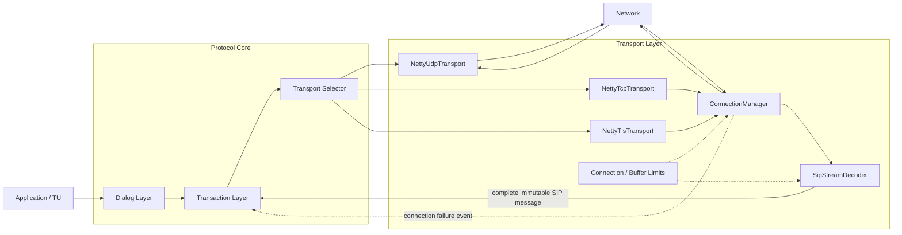
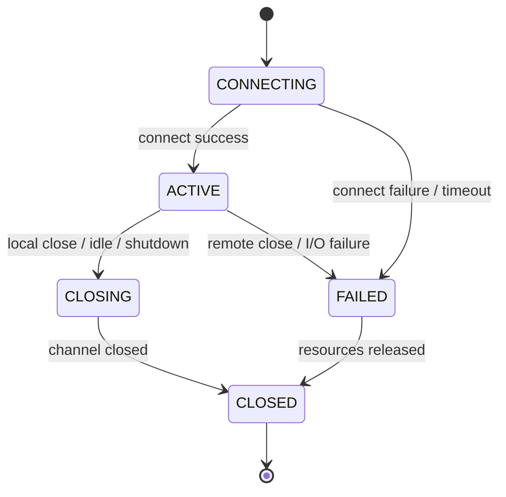

# 第五阶段：TCP/TLS 可靠传输

## 1. 背景

前四个里程碑已经提供：

- 不可变 SIP Message、完整报文 Parser 和 Encoder。
- Netty UDP Transport 及明确的 Transport 生命周期。
- ICT、IST、NICT、NIST、Timer、ACK 和 CANCEL。
- Dialog、2xx ACK、re-INVITE、BYE 和真实 UDP 基本呼叫。

当前 `SipMessageParser` 接收一条已经完成边界识别的 SIP 报文。UDP Datagram 天然提供消息边界，但 TCP/TLS 是连续字节流，可能出现半包、粘包以及同一读取批次中的多条 SIP 消息。

第五阶段在不改变 Transaction/Dialog 串行模型的前提下，引入 TCP/TLS 流式分帧、连接复用、连接失败传播和资源限制。

实施状态：5A～5C 已完成（2026-07-20），5D～5F 待执行。

## 2. 阶段目标

本阶段实现：

- TCP/TLS 共用的 SIP 流式分帧器。
- Netty TCP Client/Server Transport。
- 出站连接建立、并发合并和连接复用。
- 入站连接注册、空闲关闭和异常关闭。
- TLS Client/Server Pipeline、证书校验和握手失败处理。
- UDP/TCP/TLS Transport 选择与统一发送入口。
- 连接关闭、连接失败和写失败到 Transaction Layer 的事件传播。
- 消息、流缓冲、连接数和写队列资源限制。
- TCP/TLS 上的 Transaction、Dialog 和基本呼叫验证。

本阶段不实现：

- Digest Authentication。
- PRACK、100rel、UPDATE 和 Session Timer。
- REFER、INFO 和完整 Offer/Answer 处理。
- RFC 3263 DNS NAPTR/SRV。
- WebSocket Transport。
- Registrar、Proxy 或 B2BUA。
- JAIN-SIP Adapter。

Digest 属于 SIP 认证和请求重试状态，不属于连接生命周期。本阶段只提供 TLS 传输安全；Digest 在后续认证阶段独立实现。

## 3. 实施拆分

```text
5A  TCP/TLS 流式分帧
  ↓
5B  TCP Transport 和连接复用
  ↓
5C  TLS Transport
  ↓
5D  Transaction 与可靠连接集成
  ↓
5E  资源限制、失败和关闭竞态
  ↓
5F  TCP/TLS 完整呼叫与验收
```

## 4. 分层和全景关系



边界要求：

- Netty EventLoop 只执行连接 I/O、TLS 握手、流式分帧、编解码和快速派发。
- Transaction、Dialog 和应用回调继续在虚拟线程顺序边界执行。
- `ByteBuf`、`Channel`、`SslHandler` 等 Netty 类型不能进入 SIP 核心模型。
- Transport 不关联 SIP 响应，不执行 Transaction Timer，也不修改 Dialog。
- Transaction 根据 Transport 可靠性决定是否启动消息级重传 Timer。

## 5. 5A：TCP/TLS 流式分帧

实施状态：已完成（2026-07-17）。

### 5.1 责任

`SipStreamDecoder` 只负责从连续字节流中提取完整 SIP 报文，不负责解析 Transaction 或 Dialog 语义。

```text
TCP/TLS bytes
      |
      v
+-------------------------+
| SipStreamDecoder        |
| 1. find CRLF CRLF       |
| 2. inspect headers      |
| 3. read Content-Length  |
| 4. wait for full body   |
| 5. emit one frame       |
+------------+------------+
             |
             v
     SipMessageParser
             |
             v
     immutable SipMessage
```

### 5.2 分帧规则

- Header 结束边界为 `CRLF CRLF`。
- 流式 Transport 发送时必须包含 `Content-Length`；现有 Encoder 已统一生成该字段。
- 入站流式消息缺少 `Content-Length` 时按零长度 Body 处理，不能把后续消息吞入当前 Body。
- `Content-Length` 必须是非负十进制整数；重复字段必须值一致。
- Decoder 必须一次产生零条、一条或多条完整消息。
- Decoder 只在完整帧可用时复制为 `byte[]` 并调用现有 `SipMessageParser`。
- Parser 仍负责 start-line、Header、URI 和 Body 模型解析。

### 5.3 Decoder 状态

建议内部状态：

```text
READING_HEADERS
      |
      | CRLF CRLF found
      v
READING_BODY
      |
      | Content-Length bytes available
      v
EMIT_FRAME
      |
      +--> READING_HEADERS for next message
```

Decoder 状态只属于一个 Netty Channel，不跨连接共享。

### 5.4 分帧限制

建议增加：

```text
StreamBufferLimits
  maxStartLineBytes
  maxHeaderBytes
  maxBodyBytes
  maxMessageBytes
  maxCumulationBytes
```

`SipParserLimits` 约束一条完整报文内部大小；`StreamBufferLimits` 额外约束在完整边界尚未出现时的累计网络缓冲区。

超限或非法分帧属于连接级协议错误：

```text
report malformed message
        ↓
close offending connection
        ↓
release cumulation buffer
```

不能像 UDP 一样只丢弃一个 Datagram 后继续使用未知边界的字节流。

### 5.5 5A 测试

- 一个字节一个字节输入完整请求。
- Header 与 Body 分批到达。
- 两条或多条消息粘在一次读取中。
- 第一条带 Body，后面紧跟下一条消息。
- 缺少 `Content-Length` 时 Body 为零。
- 重复一致和重复冲突的 `Content-Length`。
- Header delimiter 跨 ByteBuf 边界。
- start-line、Header、Body、完整消息和累计缓冲区超限。
- 解析错误后释放 ByteBuf 且关闭 Channel。

已实现组件：

- `StreamBufferLimits`：独立于完整报文 Parser 的流式累计和消息大小限制。
- `SipStreamDecoderState`：`READING_HEADERS` 与 `READING_BODY` 增量状态。
- `SipStreamFramer`：纯 Java 增量分帧核心，不依赖 Netty 类型。
- `SipStreamDecoder`：Netty `ByteToMessageDecoder` 适配器，输出完整 `SipMessage`。

已验证测试：

- `SipStreamFramerTest`：9 个分帧、长度和限制场景。
- `SipStreamDecoderTest`：3 个 Netty 半包、粘包和连接级错误场景。

5A 不创建 TCP 连接、不管理 TLS 握手，也不修改 Transaction/Dialog；这些职责分别保留到 5B～5D。

## 6. 5B：TCP Transport 和连接复用

实施状态：已完成（2026-07-17）。

### 6.1 连接模型

建议增加：

```text
TransportConnectionId
ConnectionKey
TransportConnection
ConnectionState
ConnectionManager
TcpTransportConfig
NettyTcpTransport
```

连接状态：



### 6.2 Connection Key

初版连接复用键建议包含：

```text
protocol + local bind identity + remote IP + remote port
```

TLS 后续还需要加入影响安全上下文的身份信息，例如 SNI/目标主机名和 TLS profile，不能只按 IP:port 复用不同安全身份的连接。

### 6.3 出站连接建立

同一 Connection Key 的并发发送必须合并连接建立：

```text
Virtual Thread A -- send --+
Virtual Thread B -- send --+--> one CONNECTING future --> one Channel
Virtual Thread C -- send --+
```

要求：

- 只有一个实际 `connect()`。
- 等待者共享连接建立结果。
- 连接失败时所有等待发送明确失败。
- 失败连接从 Registry 原子移除，后续请求允许重新连接。
- ACTIVE 连接可以复用，CLOSING/CLOSED 连接不能接收新发送。

### 6.4 入站连接

- Server Channel 只负责接受连接。
- Child Channel 在 Pipeline 完成后注册到 ConnectionManager。
- 每条入站消息保存 protocol、local address 和 remote address。
- 对同一入站连接发送响应时优先复用该连接。
- 连接关闭后从 Registry 删除，不能遗留 Channel 引用。

### 6.5 TCP Pipeline

```text
SocketChannel
    ↓
IdleStateHandler
    ↓
SipStreamDecoder
    ↓
SipMessageParser adapter
    ↓
InboundSipMessage
    ↓
Virtual Thread Handler Executor
```

出站方向：

```text
SipMessage
    ↓
SipMessageEncoder
    ↓
Channel.writeAndFlush
    ↓
CompletionStage<SendResult>
```

### 6.6 5B 测试

- TCP Client/Server 真实回环收发。
- 半包、粘包和连续多消息。
- 多次发送复用一个连接。
- 并发首次发送只建立一个连接。
- Connect Timeout 和连接拒绝。
- 远端关闭、RST、写失败和本地关闭。
- Idle Timeout 清理。
- Transport close 后连接数归零且所有发送 Stage 完成。

已实现组件：

- `ConnectionKey`：使用协议、本地 bind identity 和远端地址标识可复用连接。
- `TransportConnectionId`、`ConnectionState`、`TransportConnection`：提供不暴露 Netty `Channel` 的连接视图。
- `ConnectionLimits`：限制总连接数、单远端连接数、待建连接数，并配置 Connect/Idle Timeout。
- `ConnectionManager`：合并同一 Key 的并发建连，登记入站/出站连接并在关闭时原子清理。
- `TcpTransportConfig`：组合监听地址、流缓冲限制和连接限制。
- `NettyTcpTransport`：TCP Client/Server、连接复用、虚拟线程回调和幂等关闭。
- `TcpChannelHandler`、`NettyTransportConnection`：处理 Channel 生命周期、入站上下文和写完成 Future。

实现边界：

- 响应发送到入站消息的远端地址时，优先复用该入站连接。
- 出站连接使用 `ConnectionKey` 合并首次并发建连；失败条目会移除，后续发送可以重试。
- 单条 TCP 连接的关闭、RST、Idle Timeout 或非法 SIP 流只清理该连接，不关闭 listener。
- Transport 关闭会拒绝新发送、关闭 listener 和全部 child Channel，并完成所有已返回的发送 Future。
- 5B 不实现 TLS、Transaction 可靠传输事件桥接和写队列字节上限；分别留到 5C、5D 和 5E。

已验证测试：

- `TcpTransportConfigTest`：2 个默认配置和非法限制场景。
- `NettyTcpTransportTest`：8 个真实回环、响应复用、并发建连、半包/粘包、拒绝、RST、非法流、Idle 和生命周期场景。

## 7. 5C：TLS Transport

实施状态：已完成（2026-07-20）。

TLS Transport 复用 5A 分帧和 5B 连接管理，只在 Pipeline、连接键和安全配置上增加 TLS 语义。

### 7.1 配置模型

建议增加：

```text
TlsTransportConfig
  bindAddress
  keyManager / certificate / private key
  trustManager / trust material
  clientAuthentication
  hostnameVerification
  handshakeTimeout
  enabledProtocols
  enabledCipherSuites
```

配置对象不能记录或输出私钥、密码或完整证书内容。

### 7.2 TLS Client Pipeline

```text
SocketChannel
    ↓
SslHandler client mode + SNI
    ↓
Handshake Future
    ↓
SipStreamDecoder
    ↓
SIP handler pipeline
```

### 7.3 TLS Server Pipeline

```text
Accepted SocketChannel
    ↓
SslHandler server mode
    ↓
optional client certificate validation
    ↓
SipStreamDecoder
    ↓
SIP handler pipeline
```

### 7.4 安全规则

- `sips:` Dialog/Route 只能选择 TLS。
- TLS 握手完成前不能发送 SIP 明文消息。
- TLS 失败后不能自动降级到 TCP。
- Client 默认执行目标身份校验，测试可注入受控 TrustManager。
- TLS profile、SNI 和目标身份必须参与连接复用决策。
- 握手失败、证书过期、不受信任、主机名不匹配分别产生可诊断异常。
- 日志不得打印私钥、Credential、Authorization 或完整敏感报文。

### 7.5 5C 测试

- 受信任自签名测试证书完成 TLS SIP 收发。
- 不受信任证书失败。
- 主机名不匹配失败。
- TLS Handshake Timeout。
- Client Authentication required/optional。
- TLS 连接复用。
- 握手期间 close/send 竞态。
- TLS 上完整 INVITE/ACK/BYE 流程。

已实现组件：

- `TlsTransportConfig`：组合 server/client `SslContext`、握手超时、主机名校验、TLS profile、协议和 cipher allow-list。
- `NettyTlsTransport`：复用 `NettyTcpTransport` 的 Client/Server、连接复用、流分帧和关闭生命周期。
- `TlsHandshakeException`、`TlsPeerVerificationException`：区分握手失败与证书/对端身份校验失败。
- `ConnectionKey`：将 TLS profile 和 outbound peer identity/SNI 纳入连接复用决策。
- TLS Pipeline：`SslHandler -> IdleStateHandler -> SipStreamDecoder -> TcpChannelHandler`。

实现边界：

- TLS 握手完成前不登记可复用连接，也不向 SIP Decoder 投递明文消息。
- Client 使用目标地址的 host name 作为 SNI；启用主机名校验时使用 JSSE `HTTPS` endpoint identification。
- 证书不受信任、主机名不匹配、握手超时均完成发送 Future，并关闭对应连接。
- TLS 失败不会降级为 TCP；TLS profile 或目标身份不同不会复用同一出站连接。
- `SslContext` 由调用方构建，配置的 `toString()` 不输出证书、私钥或信任材料。
- 5C 不实现 Digest、Transaction 失败事件桥接、写队列字节上限和 RFC 3263；分别留到后续阶段。

已验证测试：

- `TlsTransportConfigTest`：2 个配置校验、TLS profile 和敏感上下文脱敏场景。
- `NettyTlsTransportTest`：4 个受信任收发/复用、不受信任证书、主机名失败、握手超时、明文隔离和 Idle 场景。

## 8. 5D：Transport 选择与 Transaction 集成

### 8.1 统一发送入口

当前 Transaction 依赖 `TransactionMessageSender`。第五阶段建议在其后增加 Transport Selector：

```text
TransactionMessageSender
          |
          v
   TransportSelector
      |    |    |
      v    v    v
     UDP  TCP  TLS
```

建议组件：

```text
TransportRegistry
TransportSelector
ConnectionAwareMessageSender
TransportFailureEvent
TransportFailureListener
```

选择规则初版只按已经解析完成的 `TransportEndpoint.protocol` 路由；RFC 3263 URI/DNS 选择仍留到后续阶段。

### 8.2 可靠性语义

现有 `TransportReliability.from(protocol)` 继续作为 Transaction Timer 决策来源：

| Transport | 消息级重传 | Transaction 总超时 | 写/连接失败 |
|---|---:|---:|---:|
| UDP | 是 | 是 | 是 |
| TCP | 否 | 是 | 是 |
| TLS | 否 | 是 | 是 |

TCP/TLS 上不启动 UDP 的 Timer A、E、G 等消息重传，但 Timer B、F、H 等协议总超时和终止边界仍按状态机规则存在。

### 8.3 连接失败传播

一次 Channel 关闭可能影响多个并发 Transaction：

```text
Connection Closed
      |
      v
ConnectionManager
      |
      +--> pending send futures fail
      +--> bound ICT / NICT notified
      +--> waiting IST / NIST response writes fail
      +--> connection registry cleanup
```

不能只依赖 Transaction 总超时发现连接已经断开。需要在 Manager 层维护 Transaction 与连接/Endpoint 的绑定，使连接失败转换为有序 Transaction Event，而不是从 Netty EventLoop 直接修改状态机。

### 8.4 Dialog 集成

- Dialog Route Planner 继续只生成 Next-Hop URI。
- Dialog Target Resolver 输出 TCP/TLS `TransportEndpoint`。
- re-INVITE、BYE 和 2xx ACK 复用 Transport Selector。
- 可靠 Transport 上 UAS 2xx 不执行消息级重传，但仍等待 ACK 并执行生命周期策略。
- Dialog 不持有 Netty Channel。

### 8.5 5D 测试

- TCP/TLS Transaction 不启动 UDP 重传。
- 连接建立失败触发 client transaction transport failure。
- 响应写失败触发 server transaction transport failure。
- 连接关闭同时影响多个 Transaction。
- Dialog ACK、re-INVITE 和 BYE 通过 TCP/TLS 正确发送。
- 连接事件和 Timer 同时到达时状态机只终止一次。

## 9. 5E：资源限制和生命周期

### 9.1 资源限制模型

```text
ConnectionLimits
  maxConnections
  maxConnectionsPerRemoteAddress
  maxPendingConnects
  connectTimeout
  idleTimeout

WriteQueueLimits
  maxPendingWritesPerConnection
  maxPendingWriteBytesPerConnection

StreamBufferLimits
  maxCumulationBytes
  maxMessageBytes
```

### 9.2 背压和拒绝

- 不允许无限制地向一个慢连接累积写任务。
- 达到写队列上限时，新发送 Stage 明确失败。
- 达到连接上限时，新连接请求明确失败。
- Executor 拒绝不能丢失 send future 或 connection future。
- 所有限制异常必须包含类型、目标和限制值，但不能包含敏感消息 Body。

### 9.3 关闭顺序

```text
stop accepting new sends / connects
              ↓
close server accept channels
              ↓
fail pending connect futures
              ↓
close active child channels
              ↓
fail pending write futures
              ↓
drain handler callbacks
              ↓
shutdown EventLoopGroup / executors
              ↓
Transport CLOSED
```

关闭要求：

- `close()` 幂等。
- 关闭开始后不接受新连接和新发送。
- 所有已返回的 Stage 最终完成。
- 所有 Channel、ByteBuf 和 Registry 条目最终释放。
- 外部注入的 EventLoopGroup、Executor、SslContext 不由 Transport 擅自关闭。
- 生产构造器和测试构造器明确资源所有权。

### 9.4 失败模型

建议细分：

```text
TransportConnectException
TransportConnectionClosedException
TransportWriteException
TransportFramingException
TransportLimitException
TlsHandshakeException
TlsPeerVerificationException
```

异常类型要让 Transaction、日志和测试能够区分失败阶段，不能全部折叠为一个无上下文的 `TransportException`。

## 10. 5F：完整场景和验收

### 10.1 TCP 场景

```text
INVITE over TCP
  -> 180 Ringing
  -> 200 OK
  -> ACK
  -> re-INVITE
  -> 200 OK
  -> ACK
  -> BYE
  -> 200 OK
```

验证：

- 全流程复用连接。
- Transaction 不执行 UDP 消息重传。
- Dialog ID、CSeq、Route Set 和 Remote Target 正确。
- BYE 后 Dialog 和 Transaction 清理完成。

### 10.2 TLS 场景

在受控测试证书环境执行同一完整呼叫，并验证：

- TLS 握手先于 SIP 消息。
- SNI 和目标身份校验生效。
- 连接复用不跨 TLS 安全身份。
- 证书错误时没有 SIP 明文发送。

### 10.3 失败和竞态

- 第一次连接建立失败。
- 多线程并发连接同一目标。
- 发送期间远端关闭。
- Connection close 与 Transaction Timer 同时到达。
- Transport close 与 connect/write completion 同时到达。
- Stream Decoder 等待 Body 时连接关闭。
- TLS 握手期间关闭 Stack。
- 慢连接触发写队列限制。

### 10.4 验收标准

- 半包、粘包、多消息和 Body 分帧正确。
- TCP 首次连接并发合并且后续发送复用连接。
- TCP/TLS 不执行 UDP 消息级重传。
- 连接失败及时进入 Transaction Mailbox。
- TLS 握手、证书和主机名失败语义明确。
- 所有连接、缓冲区、发送 Stage 和 Registry 条目在关闭后清理。
- TCP/TLS 完整基本呼叫通过。
- 所有 Timer 测试使用虚拟时间，不使用 `Thread.sleep()`。
- 核心类和方法包含 Javadoc，协调组件类注释包含 ASCII 关系图。
- `mvn clean test` 和 `mvn javadoc:javadoc` 通过且无警告。

## 11. 建议代码组织

继续保持单 Maven module：

```text
org.loomsip.codec
  SipStreamFramer
  SipStreamDecoderState
  StreamBufferLimits

org.loomsip.transport
  TransportConnectionId
  ConnectionKey
  ConnectionState
  TransportConnection
  ConnectionLimits
  WriteQueueLimits
  TransportRegistry
  TransportSelector
  TransportFailureEvent
  TransportFailureListener

org.loomsip.transport.netty
  SipStreamDecoder
  ConnectionManager
  NettyTcpTransport
  TcpTransportConfig
  NettyTlsTransport
  TlsTransportConfig
```

`org.loomsip.codec` 不依赖 Netty；如果分帧状态实现直接继承 Netty `ByteToMessageDecoder`，该适配器必须留在 `transport.netty`，核心分帧规则仍应可独立测试。

## 12. 实施约束

- 优先复用现有 `SipMessageParser`、`SipMessageEncoder`、`SipTransport` 和 `SipMessageHandler`。
- 不为 TCP/TLS 引入 Reactor 或第二套并发模型。
- Netty Channel 生命周期由 ConnectionManager 管理，Transaction/Dialog 只能接收不可变事件。
- 不在本阶段提前实现 RFC 3263；测试使用固定、已解析的 `TransportEndpoint`。
- 不把 TLS 私钥、证书密码或 SIP Credential 写入日志。
- JAIN-SIP 兼容继续通过后续 Adapter 实现，不让 `javax.sip` 类型进入核心。

## 13. 后续阶段

第五阶段完成后建议进入“认证与 SIP 扩展”：

- RFC 3261 Digest Authentication。
- RFC 7616 SHA-256 Digest 扩展评估。
- PRACK/100rel。
- UPDATE 和 Session Timer。
- REFER、INFO 和 Offer/Answer 辅助能力。

RFC 3263 DNS、WebSocket、Registrar/Proxy、指标、追踪和 JAIN-SIP Adapter 继续作为更后续的独立能力实施。
