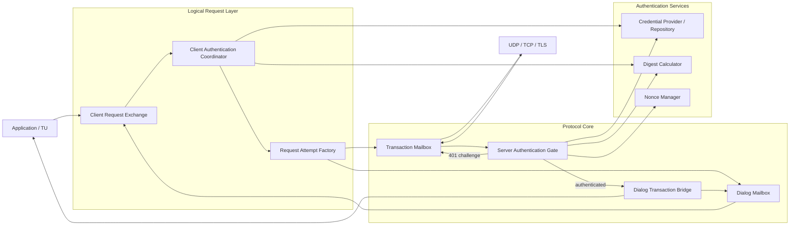

# 第六阶段：SIP 认证与扩展

## 1. 背景

前五个里程碑已经提供：

- 不可变 SIP Message、Parser、Encoder 和资源限制。
- UDP、TCP、TLS Transport，以及连接复用、失败传播和写队列限制。
- ICT、IST、NICT、NIST、虚拟 Timer、ACK 和 CANCEL。
- Early/Confirmed Dialog、Route Set、Remote Target、CSeq 和 2xx ACK。
- INVITE、re-INVITE、BYE、CANCEL 在 UDP、TCP、TLS 上的完整呼叫。

现有 Transaction 表示一次 SIP 请求尝试，Dialog 则拥有跨 Transaction 的 Call-ID、Tag、CSeq、Route Set 和 Remote Target。Digest 认证可能在一个逻辑请求中依次创建未认证和已认证的多个 Transaction；PRACK、UPDATE 和 Session Timer 又需要复用 Dialog 的顺序化状态。因此，本阶段不能把认证重试直接塞入现有 Transaction 状态机，也不能让认证组件绕过 Dialog Mailbox 修改 CSeq。

实施状态：6A～6F 已完成，6G 正在进行跨 Transport 验收。

## 2. RFC 范围与必要性

RFC 3261 定义 SIP 核心协议和扩展协商机制，但本阶段涉及的能力并不全部定义在 RFC 3261 中。

| 能力 | 主要规范 | 本阶段定位 |
| --- | --- | --- |
| Digest Authentication | RFC 3261 第 22 节；RFC 8760、RFC 7616 | 核心认证能力，优先实现 |
| Supported、Require、Unsupported、Allow | RFC 3261 | 扩展协商基础 |
| PRACK / 100rel | RFC 3262 | 独立扩展，完整实现 |
| UPDATE | RFC 3311 | 独立扩展，完整实现 |
| Session Timer | RFC 4028 | 独立扩展，完整实现 |
| Offer/Answer | RFC 3261、RFC 3264 | 提供协议钩子，不在核心解析 SDP |
| INFO | RFC 6086 | 提供通用 in-dialog 传输和分派 |
| REFER | RFC 3515、RFC 6665 | 依赖事件框架，完整语义后置 |

对 LoomSIP 的优先级：

```text
P0  Digest Authentication
P1  通用请求尝试、in-dialog 请求和扩展协商基础
P1  PRACK / 100rel
P1  UPDATE / Session Timer
P2  INFO 通用透传
P2  REFER + SUBSCRIBE / NOTIFY 事件框架
```

Parser、Encoder 和 Non-INVITE Transaction 已经能传递未知 Method 和 Header，但“能够透传”不等于“实现扩展语义”。例如 PRACK 还需要 RSeq/RAck 匹配、可靠临时响应重传、Early Dialog 路由和定时器。

## 3. 阶段目标

本阶段实现：

- 逻辑请求与单次 Transaction Attempt 的分层。
- 请求安全重建、Header 替换和新 Via branch/CSeq 分配。
- UAC 处理 401、407 Challenge 并创建认证重试 Transaction。
- UAS Digest 校验、Nonce 生命周期和重放保护。
- RFC 3261 MD5 互操作，以及 RFC 8760 SHA-256 支持。
- `qop=auth`、`cnonce`、`nc`、`opaque` 和 `stale=true`。
- 通用 Dialog 内请求生成与 Method 策略。
- PRACK/100rel、UPDATE、Session Timer 和 INFO。
- UDP、TCP、TLS 上的认证与扩展完整场景测试。

本阶段不实现：

- Digest `qop=auth-int`。
- SIP Digest AKA、OAuth 或其他认证方案。
- 主动 Preemptive Authentication；初版先挑战后认证。
- Registrar、Proxy 或 B2BUA 业务语义。
- 服务端 407 Proxy Authentication；UAC 仍需支持处理外部 Proxy 的 407。
- 完整 SDP Parser、媒体协商或媒体控制。
- REFER/SUBSCRIBE/NOTIFY 完整事件框架。
- RFC 3263 DNS、WebSocket 和 JAIN-SIP Adapter。

## 4. 实施拆分

```text
6A  请求尝试、Header 和扩展基础
  ↓
6B  UAC Digest Authentication
  ↓
6C  UAS Digest Authentication
  ↓
6D  PRACK / 100rel
  ↓
6E  UPDATE / Session Timer
  ↓
6F  INFO 与通用扩展分派
  ↓
6G  UDP/TCP/TLS 完整场景和验收
```

REFER 只在 6F 建立 Method、Header 和分派基础，完整语义进入后续事件框架阶段。

## 5. 分层与全景关系



所有权要求：

- Transaction Mailbox 只拥有一次请求尝试的状态、Timer 和网络结果。
- Client Request Exchange Mailbox 串行处理 Challenge、Credential 结果、重试和最终完成。
- Dialog Mailbox 继续独占 CSeq、Route Set、Remote Target 和 Session Timer。
- Digest Calculator 是无状态纯计算组件，不持有 Transaction 或 Dialog。
- Credential Provider/Repository 和 Nonce Manager 不在 Netty EventLoop 上执行阻塞工作。
- Transport 不解析 Authorization，不参与 Challenge 或认证重试。

## 6. 6A：请求尝试、Header 和扩展基础

实施状态：已完成（2026-07-20）。

### 6.1 逻辑请求与 Transaction Attempt

一个应用请求可能产生多个 Transaction：

```text
Logical INVITE Exchange
        |
        +--> INVITE CSeq 1 / branch A --> 401 --> non-2xx ACK
        |
        +--> INVITE CSeq 2 / branch B + Authorization --> 200
```

建议增加：

```text
ClientRequestExchange
ClientRequestExchangeState
ClientRequestExchangeEvent
RequestAttemptFactory
RequestAttemptContext
RequestRetryPolicy
```

`ClientRequestExchange` 使用独立 Mailbox，管理当前 Attempt、最大尝试次数和最终结果。它不替代 Transaction，也不直接管理 Transaction Timer。Challenge 解析和历史由 6B 的 Authentication Coordinator 管理。

### 6.2 请求重建规则

建议为不可变请求和 Header 增加结构化复制能力：

- 删除指定名称的全部 Header。
- 替换唯一 Header，同时保留其他 Header 顺序。
- 追加允许重复的 Challenge 或 Route Header。
- 重新生成 top Via branch。
- 通过请求所有者分配新 CSeq。
- 移除上一 Attempt 的 Authorization/Proxy-Authorization 后重新计算。

不能通过正则或字符串替换修改 SIP 报文。

认证重试保持原请求的 Call-ID、From Tag、请求 URI、Route 和 Body。Out-of-dialog 重试保留原始 To，不把 401/407 Response 的 To Tag 复制到新请求；in-dialog 重试保留已建立的 Dialog Tag。每次重试使用新 branch、新 CSeq 和新 Transaction。

### 6.3 通用 Dialog Method

现有 `DialogRequests` 只允许 re-INVITE 和 BYE。6A 应改为内部 Method 策略：

```text
Method     Allowed State       Target Refresh     Terminates Dialog
INVITE     CONFIRMED           yes                no
BYE        CONFIRMED           no                 yes
PRACK      EARLY/CONFIRMED     no                 no
UPDATE     EARLY/CONFIRMED     yes                no
INFO       CONFIRMED           no                 no
```

建议增加 `PRACK`、`UPDATE`、`INFO`、`REFER`、`SUBSCRIBE`、`NOTIFY` 常量，但只有已经实现语义的 Method 才进入高层便捷 API。

6A 的通用 `DialogHandle.sendRequest(...)` 是低层 Non-INVITE 扩展入口，只允许 Confirmed Dialog。INVITE、BYE、ACK 和 CANCEL 继续使用专用 API；PRACK 的 Early Dialog 规则以及 UPDATE 的 Early Dialog/target-refresh 语义分别留到 6D、6E。

### 6.4 已实现组件

- `SipMethod`：增加 PRACK、UPDATE、INFO、REFER、SUBSCRIBE 和 NOTIFY 标准常量。
- `SipHeaders.without(...)`、`withReplaced(...)`：按标准/紧凑名称等价规则删除或替换 Header。
- `SipHeaders.Builder.remove(...)`、`replace(...)`：提供结构化可变构建操作。
- `SipRequest.toBuilder()`：从有效请求复制并结构化修改 Method、URI、Header 和 Body。
- `ClientRequestExchange`：使用容量受限 Mailbox 串行化 start、retry、complete、fail 和 close。
- `RequestRetryPolicy`：限制一个逻辑请求的总 Transaction Attempt 数，并设置核心硬上限。
- `RequestAttemptFactory`、`RequestAttemptContext`、`RequestAttempt`：建立逻辑请求到具体 Transaction Handle 的泛型边界。
- `DialogMethodPolicy`：集中区分专用 Method、通用 Non-INVITE Method、target-refresh 和终止语义。
- `DialogHandle.sendRequest(...)`：通过 Dialog Mailbox 分配 CSeq、Via branch、Route Set 和 Remote Target。
- `DialogTransactionBridge`：将带 To Tag 的通用 Non-INVITE 请求先投递 Dialog Mailbox，再通知 TU。

实现边界：

- 6A 不解析 Challenge、不计算 Digest，也不自动生成认证重试请求。
- `ClientRequestExchange.retry(...)` 接收已经重建的不可变请求；6B Authentication Coordinator 负责获得 Credential 并构造新 Authorization。
- 新 Via branch 和新 CSeq 由后续 Request Attempt Factory/请求所有者生成，Exchange 本身不修改报文。
- 通用扩展请求当前不解释 INFO Body、RAck/RSeq、Session-Expires 或 REFER 事件语义。

已验证测试：

- `SipMessageModelTest`：标准扩展 Method、compact Header 等价删除/替换、请求复制且不修改源对象。
- `ClientRequestExchangeTest`：5 个初始 Attempt、重试、上限、工厂失败、并发顺序和关闭场景。
- `DialogInDialogRequestTest`：通用 INFO 出站、专用 Method 拒绝和入站通用 Non-INVITE 的 Dialog 顺序校验。
- 全量 `mvn clean test`：178 个测试通过。

## 7. 6B：UAC Digest Authentication

实施状态：已完成（2026-07-20）。

### 7.1 组件关系

```text
Transaction Response 401 / 407
              |
              v
Client Authentication Coordinator
       |             |             |
       v             v             v
Challenge Parser  Credential    Digest Calculator
       |          Provider             |
       +-------------+-----------------+
                     |
                     v
            Request Attempt Factory
                     |
                     v
              new Transaction
```

建议组件：

```text
DigestChallenge
DigestChallengeParser
DigestAuthorization
DigestAlgorithm
DigestQop
DigestCalculator
ClientCredentialProvider
ClientAuthenticationCoordinator
AuthenticationRetryPolicy
```

### 7.2 支持规则

- 401 使用 `WWW-Authenticate` 和 `Authorization`。
- 407 使用 `Proxy-Authenticate` 和 `Proxy-Authorization`。
- 支持 realm、nonce、opaque、algorithm、qop、cnonce、nc 和 stale。
- 初版支持 MD5、SHA-256 和 `qop=auth`。
- 同一响应存在多个 Challenge 时，按安全策略选择最强的可用算法。
- 不支持的算法或 qop 明确失败，不静默降级。
- `stale=true` 可以在总尝试次数限制内重新获取 Nonce 后重试。
- 默认最大认证 Attempt 数建议为 2，可配置但必须有硬上限。
- ACK 和 CANCEL 不由认证协调器主动挑战重试。

INVITE 收到 401/407 后，原 ICT 先完成非 2xx ACK，再由 Client Request Exchange 创建新的认证 INVITE Transaction。

### 7.3 Credential Provider

UAC Credential Provider 至少按以下信息查询：

```text
request target + realm + username hint + origin/proxy + algorithm
```

Provider 可以在虚拟线程上阻塞访问安全存储，但不能运行在 Netty EventLoop 或 Transaction Mailbox 的 drain 调用栈中。Credential、密码和计算中的中间值不得进入日志、异常消息或 `toString()`。

### 7.4 已实现组件与边界

- `DigestChallengeParser`：解析一个 `Digest` Challenge Header，支持 quoted-string 转义、`realm`、`nonce`、`opaque`、`algorithm`、`qop`、`stale` 和 `charset`。多个 Challenge 通过多个 SIP Header Field 提供；非 Digest scheme 被忽略。
- `DigestAlgorithm`、`DigestQop`、`DigestCharset`：初版仅接受 MD5、SHA-256、`qop=auth` 与默认 ISO-8859-1/显式 UTF-8。
- `DigestCalculator`：无状态计算 RFC Digest `qop=auth` 响应；`DigestAuthorization` 只渲染必要参数，Credential/密码不进入对象字符串或异常信息。
- `ClientDigestCredential`：Provider 每次返回一个所有权转移的凭据对象；协调器在计算完成或关闭后清除密码字符。
- `ClientAuthenticationCoordinator`：使用容量受限 Mailbox 串行化 initial attempt、401/407、异步凭据查询、请求重建、新 attempt 和关闭；多个可用 Challenge 按算法强度优先 SHA-256。
- `AuthenticatedRequestRetryFactory`：由调用方生成新的 Via branch 与 CSeq；in-dialog 场景必须经 Dialog Mailbox 分配 CSeq。协调器在重建结果上替换当前 scope 的 `Authorization` 或 `Proxy-Authorization`，并保留另一 scope 的认证头。
- 每个协调器按 origin/proxy、realm、nonce、username 和算法维护 `nc`，每次 qop-auth 重试生成新的 `cnonce`。

当前尚未存在统一 Stack API，因此 6B 提供可独立装配的协调器，而没有猜测性地向各类 Transaction callback 自动植入认证逻辑。调用方应在 Transaction 的 response callback 中调用 `onResponse(...)`；INVITE 非 2xx ACK 仍先由原 ICT 完成，再启动认证 retry。

已验证测试：

- `DigestChallengeParserTest`：转义参数、默认 MD5、qop 选择及非法/不支持 Challenge。
- `DigestCalculatorTest`：RFC MD5 qop-auth 向量、SHA-256 计算和 Authorization 转义。
- `ClientAuthenticationCoordinatorTest`：401、407、SHA-256 优先、provisional、最终完成和重试上限。

## 8. 6C：UAS Digest Authentication

实施状态：已完成（2026-07-20）。

### 8.1 服务端认证位置

```text
IST / NIST callback
        |
        v
Server Authentication Gate
    |               |
missing/invalid   authenticated
    |               |
    v               v
401 Challenge   Dialog Bridge -> TU
```

认证 Gate 必须位于 Transaction callback 与 Dialog Bridge 之间。未通过认证的请求不能更新 Dialog CSeq、Remote Target、Session Timer 或应用状态。

当前 LoomSIP 尚未实现 Proxy，因此本阶段服务端 Gate 只生成 401。UAC 仍支持 407，以便通过外部 SIP Proxy 互操作；本地 407 生成留到 Proxy 组件阶段。

### 8.2 已实现组件

```text
ServerAuthenticationGate
ServerAuthenticationPolicy
DigestCredentialRepository
DigestCredentialRecord
DigestNonceManager
DigestVerificationResult
DigestVerifier
```

UAS Credential Repository 按 realm、username 和 algorithm 返回预计算 HA1，避免要求服务端保存明文密码。

### 8.3 Nonce 和重放保护

Nonce Manager 要求：

- 使用 `SecureRandom` 或带完整性保护的服务器 Nonce。
- 配置有效期、最大活动 Nonce 数和每个 Nonce 的 username/cnonce 重放状态上限。
- 过期但结构合法的 Nonce 返回 `stale=true`。
- 原子校验 `nonce-count`，拒绝重复或倒退的 nc。
- 将 realm、algorithm 和必要的服务端身份绑定到 Nonce。
- 使用常量时间比较验证摘要结果。
- Stack 关闭时清理 Nonce 和重放状态。

认证失败响应不能暴露用户是否存在、密码来源或摘要中间值。

### 8.4 实现边界与装配

- `DigestAuthorizationParser`：解析 UAC 的单个 Authorization Digest Header，要求 username、realm、nonce、uri、response、qop=auth、nc 与 cnonce；不支持 auth-int。
- `DigestCredentialRepository`：按 realm、username、algorithm 异步返回 `DigestCredentialRecord`。Record 只持有预计算 HA1，toString 不输出 HA1。
- `DigestNonceManager`：使用 `SecureRandom` 生成 256-bit nonce，绑定 realm、算法与 charset；以容量上限管理活动 nonce，并在验证成功后原子接收严格递增的 username/cnonce nc。
- `DigestVerifier`：验证 Authorization 与 Request-URI、凭据记录、Nonce 绑定，并通过 `MessageDigest.isEqual` 常量时间比较响应摘要。
- `ServerAuthenticationGate`：缺少、格式错误、未知用户、摘要不匹配或重放时生成通用 401；仅过期的已知 nonce 设置 stale=true。Credential Repository 基础设施失败时发送通用 500，并通过下游 onLayerError 报告安全错误。
- `inviteListener(...)`、`nonInviteListener(...)`：将 Gate 包装在 `DialogTransactionBridge.serverListener()` / `nonInviteServerListener()` 之前，认证成功才进入 Dialog 和 TU；异步查询完成后通过指定的虚拟线程 callback executor 继续处理。

建议装配顺序：

```text
InviteTransactionManager
        |
        v
ServerAuthenticationGate.inviteListener(...)
        |
        v
DialogTransactionBridge.serverListener()
        |
        v
TU
```

`DigestNonceManager` 由组装层显式关闭，以清理全部 Nonce 与 replay state。当前没有统一 Stack API，因此 Gate 不自行拥有或关闭外部 Repository、executor、Dialog Bridge 或 Nonce Manager。

已验证测试：

- `DigestAuthorizationParserTest`：qop-auth 字段、quoted-pair 和非法 qop/缺失字段。
- `DigestNonceManagerTest`：严格递增 nc、重复/非法 nc、过期 nonce 与关闭清理。
- `ServerAuthenticationGateTest`：HA1 成功验证、重放、stale=true、认证 Gate 在下游 listener 前截断请求、通用失败响应。

## 9. 6D：PRACK / 100rel

实施状态：已完成（2026-07-20）。

### 9.1 责任

依据 RFC 3262 增加：

- `Supported: 100rel`、`Require: 100rel` 协商。
- RSeq、RAck 强类型 Header。
- UAS 可靠临时响应序号和重传。
- UAC 根据 Early Dialog 自动创建 PRACK。
- PRACK 作为独立 Non-INVITE Transaction。
- Fork 场景按 Early Dialog 分别维护 RSeq/RAck。

### 9.2 关系图

```text
UAS INVITE Transaction
        |
        v
Reliable Provisional Exchange
        |
        +--> 183 + Require: 100rel + RSeq
        |                  |
        |                  v
        |              retransmit timer
        |
        +<-- PRACK Transaction + RAck
                           |
                           v
                    stop retransmission
```

可靠临时响应的重传属于 Dialog/可靠响应控制器，不属于 Transport。Timer 到期后只投递 Mailbox 事件，测试使用虚拟时间。

### 9.3 错误语义

- RAck 不匹配返回 481。
- 不支持必需的 100rel 返回 420，并携带 Unsupported。
- 重复 PRACK 由 Transaction 层吸收，不重复通知 TU。
- PRACK 认证重试复用 Client Request Exchange，不在 PRACK Transaction 内部重试。

### 9.4 已实现组件与装配

- `RSeqHeaderValue`、`RAckHeaderValue` 与 `SipHeaderValues.rseq/rack(...)`：解析并验证 RFC 3262 的强类型关联字段。
- `SipExtensionSupport`：解析和写入 `Supported`、`Require`、`Unsupported` 的 option tag；用于构造 `Supported: 100rel`、`Require: 100rel`。
- `ReliableProvisionalExchange`：一个 Dialog 一个 Mailbox，UAS 为应用标记为 `Require: 100rel` 的 101-199 响应补充 RSeq，在 UDP 上按 T1/T2 重传，只有匹配 RAck 才取消 Timer。
- `ReliableProvisionalManager`：按完整 Dialog ID 保存 exchange，因此 fork 的各 Early Dialog 拥有独立 RSeq、RAck 与重传状态。
- `DialogHandle.sendPrack(...)`：Early/Confirmed Dialog 内由 Dialog Mailbox 分配新的 CSeq、Via、Route Set 和 Remote Target，再启动独立 Non-INVITE Transaction。
- `DialogTransactionBridge`：配置 manager 后，UAC 收到 `Require: 100rel` + RSeq 自动启动 PRACK；UAS 先校验 RAck，错误返回 481，随后才允许 PRACK 进入 Dialog/TU。未配置 manager 的 UAS 对 `Require: 100rel` INVITE 返回 420 和 `Unsupported: 100rel`。

装配关系：

```text
UAC INVITE response -> DialogTransactionBridge -> ReliableProvisionalManager
                                                -> DialogHandle.sendPrack -> NICT

UAS application 183 + Require:100rel -> Bridged IST handle
                                           -> ReliableProvisionalManager
                                           -> RSeq + retransmission
NIST PRACK -> ReliableProvisionalManager -> RAck match -> Dialog Bridge -> TU
```

当前无统一 Stack API，因此组装层需要创建 `ReliableProvisionalManager`，将其传入六参数 `DialogTransactionBridge` 构造器，并在 stack 关闭时调用其 `close()`。应用要在初始 INVITE 广告支持能力时，可通过 `SipExtensionSupport.withAdded(headers, "Supported", "100rel")` 构造新请求 Header。

已验证测试：

- `ReliableProvisionalHeaderValuesTest`：RSeq/RAck 与 option tag 解析/非法字段。
- `ReliableProvisionalManagerTest`：虚拟时间 T1/T2 重传、匹配/不匹配 PRACK、同一 RSeq 去重和待确认响应上限。
- `DialogInDialogRequestTest`：Early Dialog PRACK 的 RAck、新 CSeq、独立 Non-INVITE dispatch，以及普通扩展仍受 Early Dialog 限制。

## 10. 6E：UPDATE / Session Timer

实施状态：已完成（2026-07-20）。

### 10.0 已完成实现

- `SessionExpiresHeaderValue`、`MinSeHeaderValue`、`SessionRefresher` 与 `SipHeaderValues.sessionExpires/minSe(...)`：解析和渲染 RFC 4028 基础 Header。
- `SessionTimerPolicy`、`SessionTimerNegotiator`、`SessionRefreshMethod`：执行 Min-SE 校验、默认 UAC refresher 和刷新方法选择；低于最小值时返回携带 Min-SE 数值的 `SessionIntervalTooSmallException`，供 UAS 生成 422、UAC 重建新 CSeq 请求。
- `SessionTimerManager`、`DialogSessionState`、`SessionTimerAction`：使用 Mailbox 和 generation 管理替换式 deadline；本地 refresher 在半 interval 触发 REFRESH，远端 refresher 在完整 interval 触发 EXPIRE，过期回调不会影响较新的协商状态。
- `DialogHandle.sendUpdate(...)`：UPDATE 使用独立 Non-INVITE Transaction，在 Early/Confirmed Dialog 中均由 Dialog Mailbox 分配新 CSeq、Via、Route Set 与 Remote Target。
- UPDATE 被纳入 target-refresh Method：入站 UPDATE 带一个非 wildcard Contact 时更新 Remote Target，不改变 Dialog 的 Early/Confirmed 状态。
- 本地 refresher 在半 interval 创建策略指定的 UPDATE 或 re-INVITE；远端 refresher 在完整 interval 未刷新时终止 Dialog。
- 自动刷新 attempt 由 Dialog Mailbox 以 generation、CSeq 和 Method 唯一关联；同一 generation 不并行创建多个刷新工作流。
- UAC 422 重试由 Dialog Mailbox 分配新 CSeq 和 branch，每个 generation 最多一次；第二次 422、非 2xx、Transaction 超时、传输失败或请求创建失败都会终止 Dialog。
- UAS 在收到过小 UPDATE interval 时于 TU 回调前返回 `422 + Min-SE`；合法协商仅在 TU 发送 2xx 时安装 Timer，并保证 2xx 携带协商后的 `Session-Expires`。
- `ClientTransactionHandle.originalRequest()` 让 NICT 回调使用原请求 CSeq 精确关联刷新 attempt；新协商后的旧 Transaction 迟到回调不会影响新 generation。
- `SessionTimerHeaderValuesTest`、`SessionTimerNegotiatorTest`、`SessionTimerManagerTest`、`DialogInDialogRequestTest`：覆盖 Header 解析、协商/422、generation、虚拟时间刷新/到期、Early Dialog UPDATE、CSeq、target-refresh 和 Transaction 失败闭环。

### 10.1 UPDATE

UPDATE 依据 RFC 3311：

- 使用 Non-INVITE Transaction。
- 允许在满足规范前提的 Early 或 Confirmed Dialog 中发送。
- 分配新的本地 CSeq。
- Contact 存在时按 target-refresh 规则更新 Remote Target。
- 不改变 Dialog 的 Early/Confirmed 状态。
- Body 和 Content-Type 交给 TU；核心不解析 SDP。

### 10.2 Session Timer

Session Timer 依据 RFC 4028。Timer controller 的 deadline/generation 由自己的 Mailbox 串行化；会改变 Dialog 生命周期、CSeq 和自动刷新 attempt 的协调状态只由 Dialog Mailbox 修改：

```text
INVITE / UPDATE negotiation
           |
           v
Session Timer Mailbox
  - interval
  - local/remote refresher
  - refresh method
  - generation
           |
           +---- schedule ----> SipScheduler
           |                         |
           <--- REFRESH / EXPIRE ----+
           |
           v
      Dialog Mailbox
  - local CSeq allocation
  - one active refresh attempt
  - retry / terminate decision
           |
           v
   ICT / NICT new Transaction
           |
           v
2xx / 422 / timeout / transport failure
           |
           +---- Dialog ID + CSeq ----> Dialog Mailbox
```

已实现：

- Session-Expires、Min-SE 和 refresher 参数。
- UAC/UAS refresher 角色协商。
- 422 Session Interval Too Small 及新 CSeq/new Transaction 重试。
- 使用 re-INVITE 或 UPDATE 刷新，由策略选择。
- 每次刷新替换 Timer generation，拒绝过期回调。
- 刷新失败或 Session 过期时终止 Dialog；当前核心策略不自动发送 BYE。
- Stack/Dialog 关闭时取消所有 Session Timer。

422 重试建立新的 Client Transaction；认证重试继续通过 Client Request Exchange。两者的 in-dialog CSeq 都由 Dialog Mailbox 分配。

## 11. 6F：INFO 与通用扩展分派

实施状态：已完成（2026-07-21）。6F 只实现 RFC 6086 INFO 的结构化分派，不引入 Subscription 生命周期。

### 11.1 现有基础与边界

`SipMethod.INFO`、`DialogHandle.sendRequest(INFO, ...)`、Non-INVITE Transaction，以及入站 INFO 的 Dialog ID/CSeq 校验已经在 6A 完成。因此，6F 不重复建设请求生成或 Dialog 路由，而是补上 INFO 的 Header 语义和 TU 分派。

```text
NIST receives INFO
       |
       v
Dialog Bridge -- Dialog Mailbox --> identity / CSeq validation
                                        |
                                        v
                                  Info Dispatcher
                                        |
                                        v
                                  TU Info Handler
                                        |
                                        v
                              NIST response path
```

- Netty EventLoop 只负责 I/O 和派发，不能执行 INFO 业务 Handler。
- Dialog Mailbox 只负责 Dialog identity、CSeq、Route Set 和 Remote Target；不保存 INFO package 或业务 Body 状态。
- Dispatcher 不修改 Dialog，不持有 Transaction；它将不可变的已校验请求交给 TU。
- 核心不解释 DTMF、媒体控制或厂商私有 Body。

### 11.2 实施拆分

#### 6F-A：INFO Header 与请求模型

- 已新增 `InfoPackageHeaderValue`：解析和渲染单个 RFC 6086 `Info-Package` token，并提供大小写不敏感的比较键。
- 已新增 `RecvInfoHeaderValue`：解析和渲染一个或多个可广告的 INFO package token，保持 wire order，并拒绝空 token、非法分隔符和重复值。
- 已在 `SipHeaderValues` 增加结构化访问入口；Header 名称继续遵从现有大小写不敏感模型。
- 已增加不可变 `InfoRequest`、`InfoResponse` 和异步 `InfoHandler` 合约；已由 Dispatcher 接入 TU callback，并提供高层 `sendInfo(...)` API。
- 已验证：合法 token/列表 round-trip、空值/非法 token/重复 package 的确定性失败，以及 Header 大小写不敏感访问。

#### 6F-B：入站 INFO Dispatcher

- 已引入线程安全的 `InfoDispatcher` 和按 `Info-Package` 注册的 `InfoHandler`；注册按规范化 package name 查找，能力广告按确定顺序输出。已开始的分派持有当时选定的 Handler，不受后续注销影响。
- 有 `Info-Package` 的 in-dialog INFO 已按 package 分派；未注册 package 返回 `469 Bad Info Package`，并在存在注册能力时携带本端 `Recv-Info`。
- 没有 `Info-Package` 的传统 INFO 保持现有通用 Non-INVITE TU callback，避免破坏既有互操作；带 package 但没有 Dialog To tag 的 INFO 返回 481。
- Handler 的完成在 TU/虚拟线程侧处理，响应仍通过 NIST handle 发送；异常、空 completion 或响应构造失败转换为 500。
- 已验证：成功分派、未知 package 469、Dialog 外 package INFO 481、Handler 异常 500、传统 INFO 回退和注册表并发语义。

#### 6F-C：出站 INFO 与能力广告

- 已在 `DialogHandle` 增加 `sendInfo(...)` 便捷入口，复用现有 Dialog 请求创建，自动设置受管 `Info-Package` 与应用提供的 `Content-Type`/Body。
- `RecvInfoHeaderValue.applyTo(...)` 提供显式能力广告 Header helper；不隐式修改每个 INVITE 或响应。
- 出站 INFO 继续使用 Non-INVITE Transaction；响应观察沿用既有 Transaction listener，不在此阶段引入新的 Exchange。
- 已验证：CSeq、Route Set、Remote Target、Body 和 Header 的完整保留；Early Dialog 发送及调用者覆盖受管 `Info-Package` Header 都被拒绝。

#### 6F-D：REFER 边界确认

- 已验证 REFER Method 常量和通用 Confirmed Dialog 请求通路；核心仅分配 CSeq、Via、Route Set 和 Remote Target，不解释 `Refer-To` 业务语义。
- 不实现 `Refer-To`、`Refer-Sub`、NOTIFY、`Subscription-State` 或 refer event package。
- 完整 REFER 与 SUBSCRIBE/NOTIFY 作为第七阶段，在 6G 验收完成后实现 Subscription Mailbox、Expires 定时器和状态机。

### 11.3 不变量

- `Info-Package` 仅是分派键，不是 Dialog 或 Transaction identity 的组成部分。
- 同一 Dialog 的 INFO 与其他 in-dialog 请求共享 CSeq 顺序化；不同 Dialog 可并行处理。
- 一个请求最多由一个注册 Handler 接收；注册表更新不得改变已开始分派的请求。
- Header 解析失败在进入 TU 前变成明确 SIP 错误；不得把原始 Body 或敏感业务数据写入日志。

## 12. 6G：完整场景和验收

实施状态：进行中。6G-A～6G-C 已完成（2026-07-21）；6G-D～6G-F 待执行。本阶段不新增生产 Stack API。

### 12.0 实施拆分

```text
6G-A  测试场景装配基座
  |
  +--> 6G-B  Dialog + INFO 跨 UDP/TCP/TLS
  |
  +--> 6G-C  Digest 跨 UDP/TCP/TLS
  |
  +--> 6G-D  PRACK / Session Timer 组合
  |
  +--> 6G-E  并发、资源与关闭
  |
  v
6G-F  汇总验收和文档
```

#### 6G-A：测试场景装配基座

- 已在 `src/test/java/org/loomsip/testkit` 提供 `ScenarioEndpoint`、可延迟绑定的入站 Handler 和双端 Transport 生命周期 helper。
- Endpoint 只装配现有 `SipTransport`、Transaction Manager、Dialog Manager、Dialog Bridge、可选 `InfoDispatcher` 与虚拟 Scheduler；未在 `src/main` 增加 Stack facade。
- 每个具体场景仍显式创建 UDP/TCP/TLS Transport、TLS 证书、业务 Listener、认证 Gate/Exchange 和远端路由，避免测试基座隐藏协议条件。
- 所有 Endpoint 关闭时按 Dialog、Transaction、Scheduler、Executor 顺序释放资源；Transport pair 独立拥有 Socket/Netty 生命周期。
- 已验证：基座可将入站消息交给 Transaction Dispatcher，Transport pair 在关闭时释放两端资源。

#### 6G-B：Dialog + INFO 跨 Transport

- UDP、TCP、TLS 都已完成 INVITE 建立 Dialog 后的 packaged INFO。
- 已覆盖注册 Handler 200/Body、未知 package `469 + Recv-Info`、CSeq 连续性和没有回退到传统 Non-INVITE callback；TCP/TLS 场景使用连接感知 sender，TLS 使用受信任测试证书。

#### 6G-C：Digest 跨 Transport

- 已在 UDP、TCP、TLS 上完成真实 OPTIONS `401 WWW-Authenticate`、UAC 新 Attempt 和最终 `200 OK` 场景。服务端使用预计算 HA1 的 `ServerAuthenticationGate`，客户端通过 `ClientAuthenticationCoordinator` 创建认证重试。
- 已验证初始未认证请求不会到达应用回调；认证重试使用新 Via branch 和递增 CSeq，同时保留 Call-ID、From/To tag、Route、Content-Type 与 Body。三种传输均通过连接感知 sender；TLS 使用受信任测试证书。
- 本子阶段尚未覆盖 407、INVITE/REGISTER/BYE/UPDATE 的认证重试，这些仍属于后续组合验收范围。

#### 6G-D：PRACK / Session Timer 组合

- 三种 Transport 覆盖 100rel 的成功 183 + PRACK + 200 流程。
- 仅 UDP 覆盖丢失可靠临时响应或 PRACK 的重传；可靠 Transport 不重复验证 UDP 重传语义。
- Session Timer 覆盖协商、UPDATE 刷新、422 重试和过期清理；Timer 一律由虚拟时间推进。

#### 6G-E：并发、资源与关闭

- 注入同一 Dialog 的超时、Transport failure、认证或刷新完成竞争，验证只完成一次。
- 验证关闭后的 Future 最终完成，迟到事件不能复活 Transaction、Dialog 或 Exchange 状态。

#### 6G-F：汇总验收

| 场景 | UDP | TCP | TLS |
| --- | --- | --- | --- |
| Dialog + INFO | 完整 | 完整 | 完整 |
| Digest 401/重试 | 完整 | 完整 | 完整 |
| PRACK 成功路径 | 完整 | 完整 | 完整 |
| PRACK 丢失/重传 | 完整 | 不适用 | 不适用 |
| Session Timer 刷新 | 完整 | 完整 | 完整 |
| Session Timer 422/并发故障 | 一条确定性场景 | 不重复 | 不重复 |

### 12.1 Digest

- UDP、TCP、TLS 上的 401 Challenge 和成功重试。
- UAC 通过外部测试 Proxy 风格的 407 Challenge。
- INVITE、REGISTER、BYE、UPDATE 的认证重试。
- 错误密码、未知用户、非法响应摘要和不支持算法。
- 过期 Nonce、`stale=true`、重复 nc 和并发重放。
- 新 Attempt 使用新 branch、新 CSeq、新 Transaction。
- 保持 Call-ID、From Tag、Dialog Tag、Route 和 Body。
- TLS 失败不降级；Digest 不能替代 TLS 对端身份校验。

### 12.2 PRACK / UPDATE / Session Timer / INFO

- 183 + 100rel + PRACK + 200 完整 Early Dialog 流程。
- 丢失可靠临时响应和丢失 PRACK 的虚拟时间重传。
- Forked Early Dialog 使用独立 RSeq/RAck。
- UPDATE 在 Early/Confirmed Dialog 中的 CSeq 和 target-refresh。
- Session Timer 正常刷新、422 重试、刷新失败和过期清理。
- INFO 通用 Body 透传和不支持 package 的错误处理。

### 12.3 并发、资源和生命周期

- 同一逻辑请求的 Challenge、Timer、Transport failure 同时到达时只完成一次。
- 并发认证请求的 cnonce、nc 和 Nonce 状态互不污染。
- Credential Provider 超时、异常和 Stack 关闭时所有 Future 最终完成。
- Exchange、Transaction、Dialog、Nonce Registry 均有容量限制。
- 所有 Timer 测试使用虚拟时间，不使用 `Thread.sleep()` 推进协议时间。
- 日志、异常和对象字符串不包含密码、HA1、Authorization 或完整敏感报文。
- 核心类和方法包含契约型 Javadoc，协调组件类注释包含 ASCII 关系图。
- `mvn clean test`、`mvn javadoc:javadoc` 和 `git diff --check` 通过。

## 13. 建议代码组织

继续保持单 Maven module：

```text
org.loomsip.auth
  DigestChallenge
  DigestAuthorization
  DigestAlgorithm
  DigestQop
  DigestCharset
  DigestCalculator
  ClientCredentialProvider
  ClientDigestCredential
  ClientAuthenticationPolicy
  DigestCredentialRepository
  DigestNonceManager
  ClientAuthenticationCoordinator
  ServerAuthenticationGate

org.loomsip.exchange
  ClientRequestExchange
  ClientRequestExchangeEvent
  RequestAttemptFactory
  RequestRetryPolicy

org.loomsip.dialog
  DialogMethodPolicy
  ReliableProvisionalExchange
  DialogSessionState
  SessionTimerManager

org.loomsip.auth
  DigestChallengeParser

org.loomsip.message.header
  RSeqHeaderValue
  RAckHeaderValue
  SessionExpiresHeaderValue
  MinSeHeaderValue
```

认证模型不能依赖 Netty。加密摘要优先使用 JDK `MessageDigest` 和 `SecureRandom`，不为基础 Digest 引入额外密码库。

## 14. 安全与实现约束

- 认证失败默认 fail closed。
- 所有重试都有次数、时间和容量上限。
- 不在 ThreadLocal 中隐式保存 Credential 或认证上下文。
- 不缓存明文密码；短生命周期秘密在使用后尽快释放。
- 不能因为 Digest 成功而跳过 SIPS/TLS 目标身份校验。
- Authorization 只发送给匹配的 origin/realm 或 proxy，不跨目标泄露。
- Authentication Cache 的 Key 至少包含 origin/proxy、realm、用户和算法。
- Dialog、Transaction 和 Exchange 之间只传递不可变事件。
- Netty EventLoop 只负责 I/O、编解码和快速派发。
- 不引入 Reactor 或第二套异步并发模型。
- JAIN-SIP 兼容继续通过后续 Adapter 实现。

## 15. 已确定设计决策

1. Digest 属于认证和多 Transaction 重试，不进入单次 Transaction 状态机。
2. Client Request Exchange 使用 Mailbox 串行化 Challenge、Retry、Timer 和关闭事件。
3. Dialog Mailbox 继续独占 in-dialog CSeq、路由、Remote Target 和 Session Timer。
4. UAS Authentication Gate 位于 Transaction callback 与 Dialog Bridge 之间。
5. UAC 支持 401 和 407；当前无 Proxy 组件，因此本地服务端只生成 401。
6. 初版支持 MD5、SHA-256 和 `qop=auth`，后置 `auth-int` 和 AKA。
7. PRACK 可靠临时响应状态属于 Dialog/可靠响应控制器，不属于 Transport。
8. UPDATE 和 Session Timer 共用通用请求尝试与 Dialog Timer 基础。
9. INFO 提供通用分派，不在核心解释业务 Body。
10. REFER 完整语义与 SUBSCRIBE/NOTIFY 事件框架一起后置实现。
