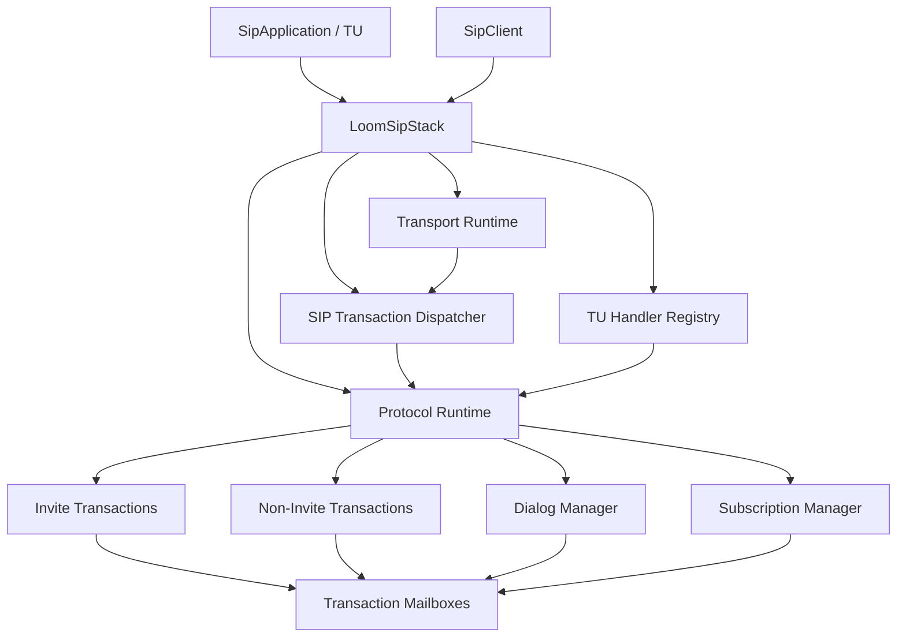

# 第八阶段：Stack API

## 1. 目标

前七阶段已经提供消息编解码、UDP/TCP/TLS Transport、Transaction、Dialog、认证、扩展协议和 Subscription 能力，但应用仍需手工装配 Transport、Dispatcher、多个 Manager、Timer 与 Listener。

第八阶段建立稳定的 Stack API，将这些内部组件组织为可嵌入、可启动、可关闭的 SIP User Agent 协议栈运行时。

本阶段不新增 SIP Proxy、Registrar、RFC 3263 DNS 解析、WebSocket 或任何特定业务协议语义。

## 2. 设计原则

- `LoomSipStack` 是资源所有权、组件装配和生命周期根节点，不是新的全局协议状态机。
- Transaction、Dialog、Subscription 继续各自通过 Mailbox 串行化状态；Stack 不创建全局事件队列。
- `build()` 只装配对象；`start()` 才绑定端口并启动 Transport，便于明确报告启动失败。
- Stack 只接受明确的出站 `TransportEndpoint`。在没有 DNS 目标选择能力前，不能由 SIP URI 隐式推导网络目的地。
- 应用在启动前注册入站处理能力；运行时路由配置冻结，避免动态修改路由引入不可预测的并发行为。
- Stack 只关闭自己创建的资源。外部注入的 Executor、Scheduler 或 Transport 必须显式声明是否由 Stack 接管。

## 3. 全景关系



```text
Application command
       |
       v
   SipClient facade
       |
       v
Transaction / Dialog / Subscription owner
       |
       v
Mailbox-serialized protocol state
       |
       v
Netty Transport I/O
```

## 4. 公共 API 轮廓

初版公共 API 以以下类型为中心：

```text
LoomSipStack
SipStackBuilder
SipStackConfig
SipStackState
SipStackListener
SipClient
SipApplication
IncomingRequestContext
StackTransportFactory
StackResources
```

建议使用方式：

```java
try (LoomSipStack stack = LoomSipStack.builder()
        .transport(NettyTransports.udp(udpConfig))
        .transport(NettyTransports.tcp(tcpConfig))
        .application(application)
        .build()) {
    stack.start().toCompletableFuture().join();
    stack.client().request(request);
}
```

### 4.1 LoomSipStack

`LoomSipStack` 提供稳定的运行时入口：

```java
public interface LoomSipStack extends AutoCloseable {
    SipStackState state();
    CompletionStage<Void> start();
    SipClient client();
    CompletionStage<Void> closeAsync();
    void close();
}
```

- `client()` 在 `RUNNING` 前不可用于发送协议命令。
- `start()` 与 `closeAsync()` 均幂等；并发调用共享同一生命周期结果。
- `close()` 按配置的 shutdown timeout 等待 `closeAsync()`，超时后报告确定性关闭失败。

### 4.2 SipClient

`SipClient` 是出站协议命令的稳定门面，不向应用暴露 Transaction Manager。

初版保留通用请求能力，并在已有核心能力上提供类型化入口：

```text
request(OutgoingRequest)
invite(InviteRequest)
subscribe(InitialSubscriptionRequest)
refresh(SubscriptionRefreshRequest)
```

调用方必须显式提供本地身份、目标 `TransportEndpoint`、CSeq 所有权所需的上下文，以及业务 Body。Stack 不猜测路由，也不解析业务 Body。

### 4.3 SipApplication 与入站上下文

单一不断增长的 Application 接口会使扩展协议持续破坏兼容性，因此采用按能力注册：

```java
LoomSipStack.builder()
        .inviteHandler(inviteHandler)
        .requestHandler(fallbackHandler)
        .infoPackage("example", infoHandler)
        .subscriptionPackage("example", subscriptionHandler)
        .referHandler(referHandler);
```

通用入站处理使用 `IncomingRequestContext`：

```text
IncomingRequestContext
  |- immutable SipRequest
  |- TransportContext
  |- server Transaction response capability
  |- optional Dialog / Subscription correlation
  `- one response decision
```

应用可异步完成业务决策，但一次入站 Transaction 只能由该上下文完成一次最终 Response。应用回调运行在 Stack 的协议回调 Executor，不得阻塞 Netty EventLoop。

## 5. Transport 装配边界

Stack API 不直接依赖某个 I/O 实现。Transport 通过工厂绑定入站 Handler：

```java
@FunctionalInterface
public interface StackTransportFactory {
    SipTransport create(SipMessageHandler inboundHandler);
}
```

Transport 模块提供相应工厂，例如：

```text
NettyTransports.udp(...)
NettyTransports.tcp(...)
NettyTransports.tls(...)
```

初版约束：同一 Stack 每种 TransportProtocol 最多一个监听 Transport，与现有 `TransportRegistry` 的一协议一实例模型一致。多监听地址或同协议多实例在后续独立扩展。

## 6. 配置与资源所有权

`SipStackConfig` 聚合已有不可变配置，而不复制其字段：

```text
SipStackConfig
  |- parser / stream limits
  |- transport bindings and limits
  |- transaction timer and capacity limits
  |- dialog and subscription limits
  |- authentication and extension options
  `- shutdown timeout
```

`StackResources` 明确以下资源的所有权：

| 资源 | 默认策略 | Stack close 行为 |
| --- | --- | --- |
| 协议回调 Executor | Stack 创建虚拟线程 Executor | 关闭 |
| Scheduler | Stack 创建 | 关闭 |
| 外部 Executor / Scheduler | 调用方拥有 | 不关闭 |
| Stack 创建的 Transport | Stack 拥有 | 关闭 |
| 外部 Transport | 调用方显式选择 | 依 ownership 决定 |

容量配置必须保留 Transaction、Dialog、Subscription、连接、写队列和 Mailbox 的独立限制，不能折叠为一个模糊的全局连接数。

## 7. 生命周期与关闭

```text
NEW -> STARTING -> RUNNING -> CLOSING -> CLOSED
          |           |
          +---------> FAILED -> CLOSING
```

启动顺序：

1. 创建 Executor、Scheduler、Manager、Dispatcher 和入站路由。
2. 通过 `StackTransportFactory` 创建 Transport，并注册至 `TransportRegistry`。
3. 启动全部 Transport；任一失败时关闭已启动 Transport 和已创建资源。
4. 所有 Transport 成功后进入 `RUNNING`。

关闭顺序：

1. 原子切换至 `CLOSING`，拒绝新的 SipClient 命令。
2. 停止入站新工作，并关闭 Subscription、Dialog 与 Transaction 所有者。
3. 关闭 Transport，完成或失败剩余网络发送。
4. 关闭 Scheduler 与 Stack 自建 Executor。
5. 进入 `CLOSED` 并完成 `closeAsync()`。

初版提供确定性快速关闭。真正的优雅 drain、分阶段 listener stop 和可恢复重启在后续阶段讨论，不能在 API 中假装已经提供。

## 8. 错误与诊断

`SipStackListener` 接收 Stack 级错误与状态变化：

```text
Transport start failure
Dispatcher failure
Callback failure
Resource shutdown failure
Unexpected lifecycle transition
```

监听器异常必须被隔离，不得阻断协议状态机或关闭流程。诊断信息至少包含组件类型、TransportProtocol、Transaction / Dialog / Subscription 摘要与错误类别；不得默认记录认证凭据或业务 Body。

Stack 应提供只读状态快照，以支持运行时诊断：

```text
StackStateSnapshot
  |- state
  |- bound transport endpoints
  |- active transaction/dialog/subscription counts
  |- connection and pending-write counts
  `- last failure summary
```

## 9. 实施拆分

```text
8A  Stack Config、Resources、State 与生命周期骨架
 |
 v
8B  Transport Factory、Registry 自动装配与启动失败回滚
 |
 v
8C  TU Handler Registry 与 IncomingRequestContext
 |
 v
8D  SipClient 通用出站门面及已有高级能力桥接
 |
 v
8E  关闭收敛、状态快照、错误监听与容量诊断
 |
 v
8F  UDP/TCP/TLS Stack 端到端验收
```

### 8A 实施状态

已完成（2026-07-21）。新增 `LoomSipStack`、单次使用的 Builder、不可变 `SipStackConfig`、`SipStackState` 和带显式资源所有权的 `StackResources`。当前生命周期骨架只接管 `TransportRegistry` 与 Stack 自建资源：`build()` 不绑定端口，`start()` 启动 Transport，启动失败进入 `FAILED` 并释放自有资源，`closeAsync()`/`close()` 幂等关闭 Transport 与自有资源。Transaction、Dialog 和 Subscription 的 Mailbox 所有权没有变化。

### 8B 实施状态

已完成（2026-07-22）。新增 `StackTransportFactory` 及 `NettyTransports.udp/tcp/tls(...)` 工厂；Builder 通过 `transport(protocol, factory)` 声明 Stack 自建 Transport，且仍支持转交外部 `TransportRegistry`，两种方式不可混用。Factory 在 `start()` 中才创建并注册 Transport，因此 `build()` 不会创建 Netty 资源或绑定端口；创建或启动失败时统一关闭 Registry，回滚已创建或已启动的 Transport，并使 Stack 进入 `FAILED`。

### 8C 实施状态

已完成（2026-07-22）。新增不可变 `IncomingRequestContext`、`IncomingRequestHandler`、启动后不可变的 `TuHandlerRegistry` 与 `TuServerTransactionBridge`。Builder 现创建共享资源上的 INVITE/Non-INVITE Transaction Manager，并将 Transport 入站 Handler 接入 `SipTransactionDispatcher`；Bridge 在既有有序 TU callback 中按 INVITE 或通用请求分派。Context 可发送任意数量的 `1xx`，但只接受一次最终响应。未注册能力返回 `501`，业务 Handler 异常被隔离并在尚未完成最终响应时返回 `500`。Dialog、Subscription 与扩展协议的自动桥接留待后续 Stack 阶段。

### 8D 实施状态

已完成（2026-07-22）。新增状态门控的 `SipClient`，提供 `request(OutgoingRequest)` 与 `invite(InviteRequest)`；调用方必须提供完整不可变请求与明确 `TransportEndpoint`，Stack 不推导网络目标。所有命令仅在 `RUNNING` 可提交，启动前、关闭中或关闭后立即抛出 `IllegalStateException`。INFO、REFER、初始 SUBSCRIBE 可通过通用 Non-INVITE 入口发送；需要 Dialog 或 Subscription 身份的类型化 API 在相应 Runtime 自动装配后实现。

### 8E 实施状态

已完成（2026-07-22）。新增 `StackStateSnapshot`、每 Transport 的 `StackTransportSnapshot` 与可选 `TransportDiagnostics`；快照包含生命周期、绑定端点、Transaction 活动计数、Netty 连接数、本地 pending send 数及不含敏感 SIP 内容的最后失败摘要。新增 `SipStackListener`，状态与失败通知经 Stack callback executor 异步投递，监听器异常被隔离。`snapshot()` 可在任意生命周期状态读取。

### 8F 实施状态

已完成（2026-07-22）。新增真实 UDP/TCP Stack 回环验收：Builder Factory 绑定临时端口，`SipClient` 发起 OPTIONS，入站请求经 Dispatcher/IST-NIST 到达 TU Handler 并返回 200。TCP/TLS 的连接与 TLS 握手底层验收继续复用既有 Netty 专项测试。

## 10. 验收标准

- 应用无需直接构造 Transaction Manager、Dialog Manager、Subscription Manager 或 Dispatcher。
- UDP/TCP/TLS 的单 Transport 和组合 Transport 可通过同一 Builder 启动。
- 任一 Transport 启动失败会回滚已创建资源，Stack 不进入 `RUNNING`。
- 重复 `start()`、重复 `closeAsync()`、`start()` 与 `closeAsync()` 并发竞争具有确定性结果。
- 关闭后新的 SipClient 命令立即失败；迟到 Transport 事件不得复活任何协议所有者。
- TU callback、Stack listener 与 Transport error 互不阻塞，异常均被隔离并可诊断。
- Stack API 的 UDP/TCP/TLS 场景复用既有 Transaction、Dialog、Subscription 与认证验收，不重新实现协议状态机。

## 11. 非目标

- SIP Proxy、Registrar、B2BUA 或第三方呼叫控制。
- RFC 3263 NAPTR/SRV/A/AAAA 解析与自动目标选择。
- WebSocket、HTTP API、配置文件格式或服务发现。
- 多监听地址、同协议多个 Transport 实例、热重载和运行时动态路由注册。
- JAIN-SIP Adapter、持久化、分布式复制和集群协调。
